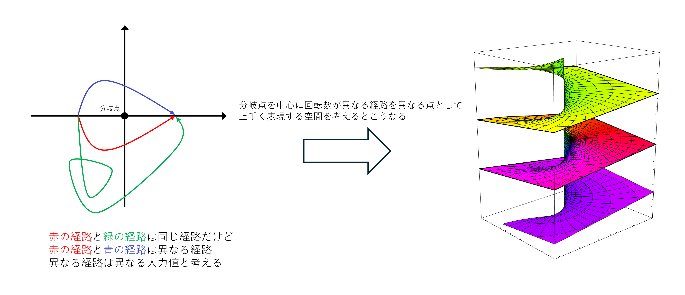
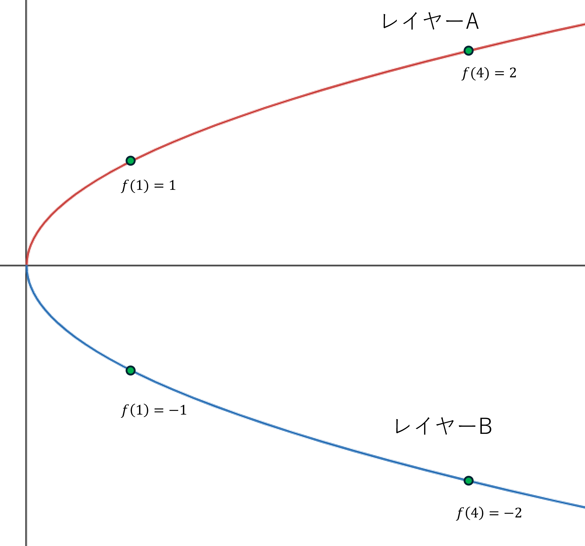
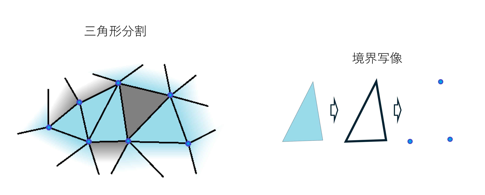
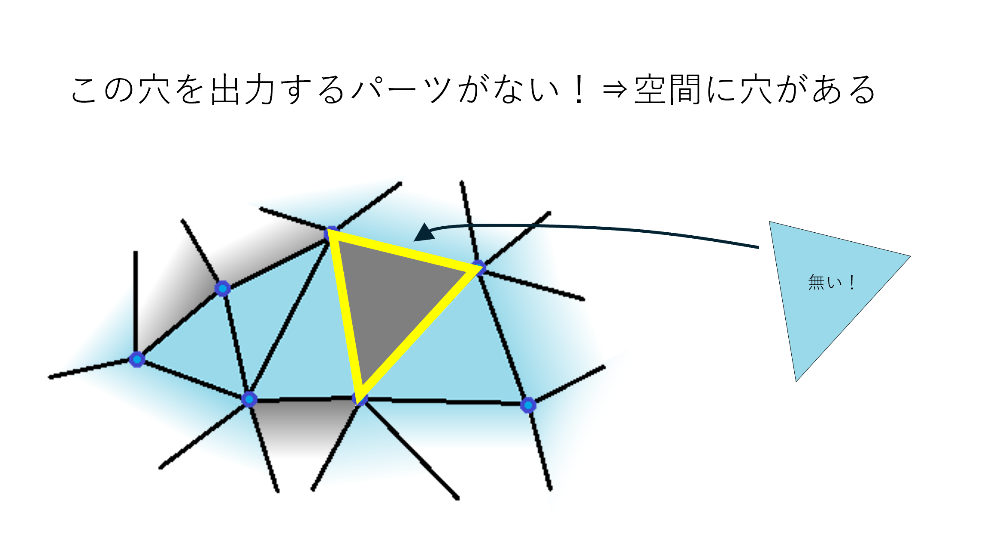
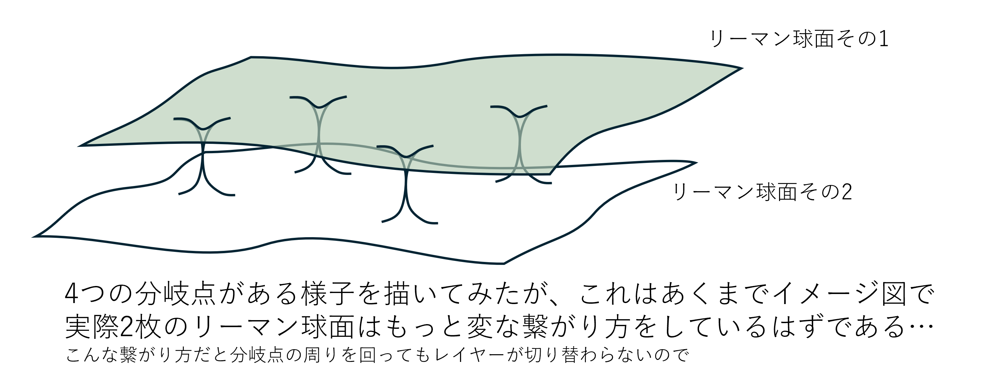
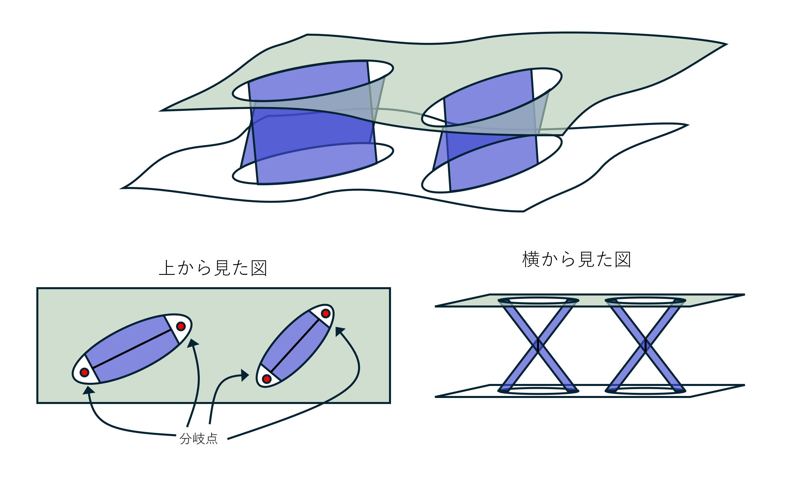
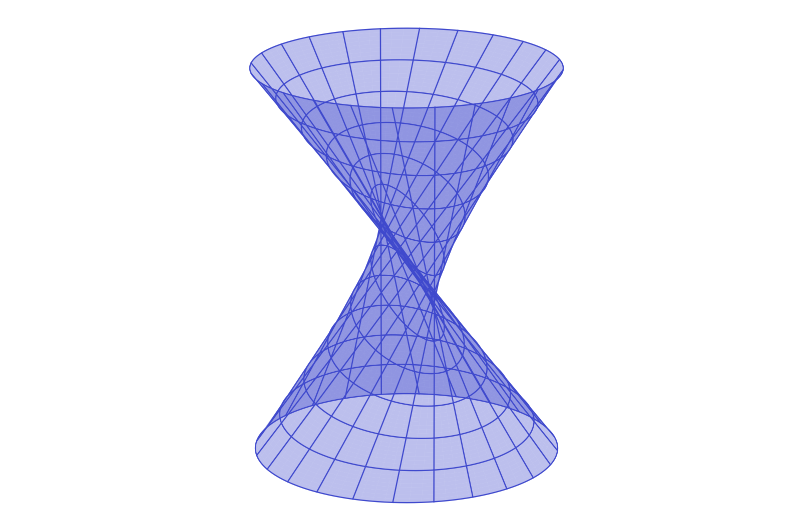

# アーベル関数論と代数幾何学の歴史独学02

いよいよアーベル関数論の話になる。主役はゲオルク・フリードリヒ・ベルンハルト・リーマン（以下リーマン）である。おなじみのあのリーマンである。

## リーマン面

ヤコビの逆問題の解はアーベル関数と呼ばれる。このアーベル関数というものを分析するために非常に大きな働きをしたのがリーマン面という概念である。が、このリーマン面はヤコビの逆問題を解決するために導入された概念という訳ではなくて、複素関数の一般論について論述される文脈で定義された概念である。なので、時代はほんの数年だけ巻き戻ることになる。
こんな話を読んでる時点で読者はおそらく複素関数論はある程度知っているのではなかろうか。一応軽く事実を確認しておこう。
複素関数$f(z):=1/z$に対して$z=1$を始点として積分を行う。これが実関数の積分であれば$\ln x$で終わりだ。が、複素関数の積分なので経路を考える必要がある。複素平面上で正則であるならば経路を考える必要はない（∵コーシーの積分定理）のだが、今回$f(z)$は$z=0$に$1$位の極を持っている。なので、積分の経路が$z=0$のあっち側を通るかこっち側を通るかによって積分の結果が変わる訳である。これはすなわち原始関数を考えようとすると多価関数になってしまうということを意味している。多価関数であるということは、関数ではないということである。関数というのは$1$つの入力に対して$1$つの出力しか許さないのであるから。
これを解決する方法はいくつかある。例えば、出力されるのが複素数単体ではなくその集合であると考えるなら、出力は$1$つの集合であると言えるだろう。これは被覆空間のファイバーという概念に相当する。他にも、考えられる出力を虚部が$[0,2\pi)$の範囲に絞ってやっても良い。これは主値を与えるという考え方になるだろう。対してリーマンが考えた解決方法はスマートなものだった。そもそもあっち側を通った時の$z=0$とこっち側を通った時の$z=0$は異なる値であると考えたのだ。
リーマンが考えた空間はこうだ。$f(z)$を積分するということを考える際に想定する空間は単なる複素数平面ではなく、$z=0$を軸にねじれた空間である。同じ点のように見えても$z=0$を中心にぐるっと回ってきた点（$z=0$を中心とした回転数が$0$ではない閉路に沿って移動した点）は元の点とは異なるレイヤーに移動してしまっていると考えるべきだということだ。このねじれた空間をリーマン面と呼ぶのである。もしくは簡単な例の場合は以下のように図形的に理解すれば視覚的に納得できるかもしれない。この平面上の適当な点を始点として、軸を中心に平面に沿ってちょうど$180\degree$移動したら、時計回りか反時計回りかで終点位置に上下$1$枚分のレイヤーの差が生まれてしまうが、単なる複素平面として真上から観察するとその差は確認できないという感じだ。

別の説明を試みてみよう。まず積分結果は積分経路によって値が変わる、すなわち同じ入力値であっても、その入力値に至る経路が異なれば異なる値が出力されるという多価性が存在する。この時、「経路が異なる」という判断は分岐点から見た経路の回転数（どっち方向に何度回転したかという情報）によって定められる。この「回転数が異なるならば異なる値である」という現象を上手く空間の形として表すならばどうすればいいか？それは分岐点を中心とした螺旋状の空間であると考えるという方法である。こうすれば確かに回転数がレイヤーの差という形で異なる空間に配置されることになる。

ただし、この説明はあくまで入力値に着目した説明になってしまっている点に注意して欲しい。リーマン面は多価性、すなわち「同じ入力値なのに異なる出力値になっている」という現象を上手く説明するために導入された概念であるから、この図では無限にレイヤーが重なっている様に見えるが、例えば$1$つの入力値に対して出力値が$3$通りしかなければ、同じ値を出力するレイヤーは統合されてレイヤーも$3$枚だけになるはずである。
実際にその様な例を$1$つ考えてみよう。さっきの例では極の周りを回る度に別のレイヤーに移動していた（つまり回転する度に出力値がどんどん変わっていく例を考えていた）が、$2$周したら元のレイヤーに戻るような極が存在する場合（例えば$1$周したら計算結果が$-1$倍になるような…これは$\sqrt{z}=e^{\frac{1}{2}\int\frac{1}{z}dz}$という具体例が挙げられる）。これもリーマン面である。この（$\sqrt{z}$の）リーマン面を図形的に描くなら以下のようになるが、交差してるように見える部分はもちろん本当は交差していない。$3$次元では交差しないように描けないのだ。だからリーマン面はできれば視覚的なイメージをベースにしつつも抽象的に理解する様に努める必要がある。

まだイメージが掴めないという場合は$x$の平方根を取る関数の実関数としてのグラフを考えてみよう。リーマンが行ったのは以下の図の様なことだ。すなわち、$f(4)=2$と$f(4)=-2$の様に複数の値が出てしまうのであれば、前者の$4$と後者の$4$は異なるレイヤーにいると考えるのである。これは、$x$の平方根が$y$となる点全体の集合（すなわち曲線$x-y^2=0$）上の点を定義域として解釈し直したと考えることが出来る。この時のこの曲線こそリーマン面と呼ばれるものである（実数上で考えるから曲線になっているが、複素数上で考えると曲面になるのである）。

時代の針を一気に現代まで進めて1913年、ワイルという人物が全てのリーマン面と$1$次元複素多様体は同値であるということを示したため、現代ではリーマン面というと$1$次元複素多様体を指す言葉ではあるが、モチベーションとしては極を持つ複素関数の積分の定義域を指していると考えるのが良いだろう。もちろん現代数学において多様体論による抽象化は大事な業績ではあるが、今はまだ語る時ではない。
リーマン面の概念は非常に洗練されており、定義されてから数年後にすぐにアーベル関数を対象に適用された。ここから周期関数とリーマン面は切っても切り離せない関係になっていった訳である。

## リーマン面の幾何学的意味

もう少しリーマン面についての話を深堀りしておこう。前回の話は比較的解析的な話が多かった。微分とか積分とかしてるんだからそりゃそうだ。でも、リーマン面という概念はそこに幾何学的な視点を与えた。$1/z$の積分によって与えられるリーマン面は$z=0$に閉じがたい穴を持っており、事実その周りを何周するかによって積分結果が変わった。もし閉じられるのであれば、そんなことは起こり得ないだろう。この空間に開いた穴というのに対して幾何学ではそれを解析する手段が存在する。
ここから幾何学の話になるのだが、全く別の文脈の話になるので、詳細に説明することを避けて概念的な説明に留めておく。もし難しいと感じたら何となくで読む感じでも問題ないだろう（後に補足するが、今から導入しようとしている概念はリーマン面が生まれた当時は存在しなかった概念である）。
さて、空間に開いている穴の個数を数える手段だが、いくつかある。最も分かりやすいものを挙げるならそれはホモトピーという概念によって定義される、基本群という概念である。これは、グネグネと連続的に動かすことで一致する様な閉路を同一視して、また2つの閉路は互いの始点と終点を繋いで結合する様な方法による和が定義されていると考えることで、群を考えるというものだ。連続的にしか動けない閉路は穴を飛び越えることはできないため、その群は空間の穴の様相によって制限を受けて、穴の情報が群構造として現れるという訳だ。この概念は比較的分かりやすく、トポロジー関連のトピックの入門としてよく扱われる。始点と終点が与えられた時に本質的に異なる様な積分経路が何通りあるのかみたいな事を考える際はこの基本群を考えるのが良いだろう。
空間の穴の個数を数えるための手段として、基本群とは異なるもう1つの方法としてホモロジー群というものがある。リーマン面にとって大事なのはどちらかというとこちらだ。この様な場所で簡単に説明できるほど簡単な概念ではないのだが、それでも簡単に説明するとしたら、まずは空間を各パーツが球や円板などのような簡単な形と同相になるように十分に細かく切り分け（初歩的な方法としては三角形分割というものがある）、各パーツに対して境界写像と呼ばれる「$\cdots$→$3$次元胞→$2$次元胞（面）→$1$次元胞（辺）→$0$次元胞（点）」という流れで推移する列を定義する。

ここでは穴というのは各パーツの境界の様な形を指している（$2$次元なら球の境界である球面、$1$次元なら円板の境界である円周）。ここでもし単にパーツが並んでいるだけならば、境界写像によって消える様な全ての穴は何らかのパーツの境界になっているはずだが、空間自体が穴を持っている場合はそれを境界とする様なパーツが存在しないのである。それを使って空間の各次元における穴の個数を見るというものである。

リーマン面、つまり複素解析では主に経路の話をすることになるので$1$次元の穴を探すことになる。基本的にはリーマン面の$1$次元の穴の個数は偶数個になる。これを$2$で割った数をリーマン面の種数と呼び、主に$g$という変数で表す。これが次の話におけるキーアイテムとなる訳である。

上記の話の補足として、当時1851年のリーマンはこの種数というものをもっと素朴な方法で定義していた。具体的には、曲面を境界を持つ単連結（任意の閉路が連続的に1点に縮められる図形）なパーツに分解するために必要な互いに交わらない切断線の本数を数えるという方法を使っていた。素朴ではあるが、図形的な直感を要求する定義となっており、どちらの方が分かりやすいかについては人それぞれかもしれない。
この話は$2$次元に限ったものであったが、1871年のエンリコ・ベッチ（以下ベッチ）によってより一般の次元に対して扱える様にベッチ数というものが定義された。そこからさらに1895年にポアンカレがホモロジーという図形を足し引きできる様な枠組みを作り上げ、そこにおける部分多様体の類の最大個数としてベッチ数の説明が与えられた。そしてさっき説明した様な群構造については、1926年頃にエミー・ネーターが、境界写像によって消えずに残るものの集まりそのものが1つの群になっており、ベッチ数はその群の大きさ（次元）を表しているに過ぎない、と指摘したことで、現代的な定義に辿り着く。
ここまで洗練されるまでにも長い歴史が存在した訳である。つまり、リーマンは最初からホモロジーとかを理解していたのではなくてもっと素朴なモチベーションを持っていたのである。もしホモロジー周りの話が分かりづらいと感じたなら、さっきも言ったが一旦素朴な理解を優先してしまうのが良いだろうと思う。それこそが偉大な数学者も通った道なのだから。

さらに追加で、次の話に行く前に補足する必要がある話として、リーマン球面というものがある。これはリーマン面の一種なのだが、複素平面に無限遠点を追加することで得られる球面である。複素数の分布を無限に広がる平面と捉えるのではなくて、ある意味で有界な球面として捉えることで非常に扱いやすくなる。複素解析の分野では「複素数全体」と言う時はリーマン球面を指していると考えることが多い。例えば前回触れた「定数ではないあらゆる正則な複素関数は有界ではない」という定理はリーマン球面を用いると「リーマン球面上全体で正則な複素関数は定数関数のみである」と有界性に触れないシンプルな表現に言い換えられる。今後複素数はリーマン球面を前提として平面ではなく球面であるかのように扱うことがあるので、注意されたい。
簡単に複素平面とリーマン球面の対応について触れておこう。おおよそ以下の図の通りで、北極（球面の一番上の点）から球の内部に向かって線を引いた時に、その先で球面と平面にそれぞれ$1$度だけ交点を持つので、その$2$点を対応付けるという感じだ。この対応では北極を除く全ての球面上の点と平面上の点は複素多様体として適切に（もう少しだけ明確に言うなら同相写像として、つまり十分近い点は十分近い点に写る様な全単射として）対応する。この時平面上で原点から点が遠ざかれば遠ざかるほど、そこに対応する球面上の点は北極に近づくため、北極は無限遠点として扱われる。つまり、リーマン球面は複素平面に無限遠点を追加した空間として解釈できるという訳である。

## 楕円関数とトーラス

さて、リーマン面を理解したところで今までの楕円関数がどう扱われることになるのかについて今一度確認しよう。
まず、今まで考えてきた楕円関数というのは例えば以下のように定義される楕円積分の逆関数であった。

$$
\int\frac{dt}{\sqrt{(1-t^2)(1-k^2t^2)}}
$$

ここで使われている根号であるが、実は（前の章でちょっと触れたが）複素数において根号は以下のような形で定義され、$z=0$（根号の中の式の零点）で分岐することが知られている。

$$
\sqrt{z}=e^{\frac{1}{2}\int\frac{1}{z}dz}
$$

さて、ただし今回考えるのは$f(z)=\sqrt{z}$のリーマン面ではなくて$f(z)=\sqrt{(1-z^2)(1-k^2z^2)}$の様に根号の中に$4$次多項式などが入った場合のリーマン面である。根号の中の式の零点は最大$4$個になる。その$4$箇所がそれぞれ分岐点になっているはずだ。ここで根号の分岐点はその周りを回るような経路において出力値が$-1$倍されるという形で分岐するのだった。分岐点は複数あるがいずれも$-1$倍という差を生むだけなので、$1$個の入力値に対してありうる出力値も$w$と$-w$の様な形の$2$通りとなる。すなわちリーマン面全体としては出力値軸方向に$2$枚分のレイヤーあることが予測できる。改めて説明するが、レイヤーは異なる出力値の数だけ発生するのであって、分岐点が増えたからといって増えるものではない。各レイヤーはひとまず複素数全体と考えたらリーマン球面であると考えられる。すなわち、分岐点の周りを移動することでその$2$枚のリーマン球面を行ったり来たりすることになるということだ。では、どういう移動では球面間の移動が発生して、逆にどういう移動であれば移動が発生しないのだろうか？

まず前提として$1$個の分岐点を選んでそれの周りを回る様な経路だと積分結果は$-1$倍になるので、別のレイヤーになる。$2$つだとどうだろうか。$-1$倍が$2$回作用するから元のレイヤーに戻ってくるはずである。$3$つの場合は$3$回作用して別レイヤーということになる。つまり直感的には、$2$つの分岐点をグループにまとめたとして、その間を通ると別のレイヤーに行ってしまうと考えると分かりやすい。イメージ的には以下のような感じだ。

分岐点近くが未定義に見えるが、$\sqrt{z}$の分岐点と同じ様に上手く接合すれば良い。そうすると各グループはその近傍を以下のような途中で反転する円柱で繋ぐ様な形になり、リーマン面全体としては$2$個のリーマン球面を円柱で繋いだようなものになる（途中で反転しているのが$2$箇所になるので、それぞれねじってやれば円柱と見做せる）。

したがって、このリーマン面は球面を$2$個の筒で繋げたものなので、トーラスになるということが分かる。

## 楕円関数の周期性の図形的直感による説明

さて、楕円積分のリーマン面がトーラスであることが分かったが、これはつまりどういうことだろうか。今までのリーマン面の説明に基づくならば、この積分の経路は複素数（リーマン球面）ではなくトーラス上の線に沿って行われていたと考えるべきであるということが分かる。つまりこの積分はトーラス上の値を入力としていたということだ。

ところで、トーラスには緯線と経線という概念がある。上の図で言うところの青い線と赤い線である。つまりトーラス上における「$1$周」という概念は$2$つ存在しているということだ（これはトーラスの種数が$2\div2=1$であることに対応している）。リーマン面の上でならば積分は正しく関数であるため、入力値を動かしても$1$周して元の点に戻ってきた場合は関数として同じ値になる。ただしこの場合は積分なので、同じ値を取る関数の積分ということで$1$周する度に積分値は同じ値の分だけ加算されていくことになる。
さて、ここで緯線方向に$1$周した場合の積分値の増加量を$2\omega$、経線方向に$1$周した場合の積分値の増加量を$2\varpi i$としよう。すると、この積分の逆関数である楕円関数の振る舞いについて、入力値が$2\omega$ないし$2\varpi i$増加させた場合は出力値（つまりトーラス上の点）は元の位置に戻っているということが分かる。これはつまり、$2\omega$および$2\varpi i$がこの楕円関数の周期であるということを意味しているのである。
