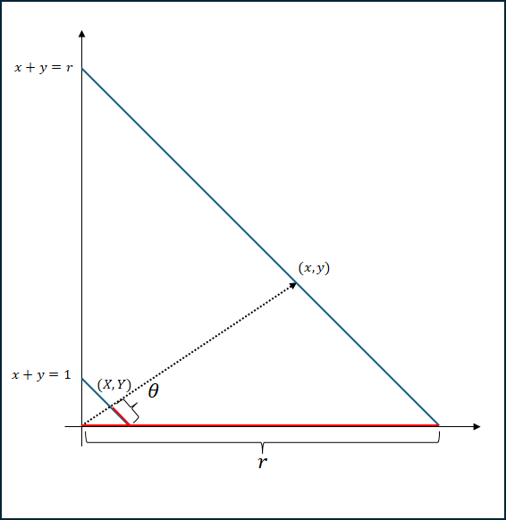
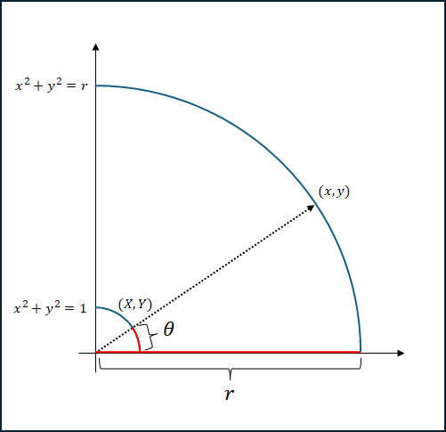

# 雑談

指数分布と正規分布について、確率密度関数を見てみると（些末な定数部分を除去すると）$e^{-x}$と$e^{-x^2}$となっていて、差が$e$の指数の$x$の指数が$1$か$2$かってだけで結構似てるなって思ってた。
その似てる様子に関して面白い類似性が見られたので共有する。

まず、正の実数値を取る独立な確率変数$x,y$が存在するとする。

最初は$x,y$がそれぞれ指数分布に従う時、$x$と$y$の同時分布は$e^{-(x+y)}$になる。ここで$r=x+y$として、さらに$X=\frac{x}{r},Y=\frac{y}{r}$とする。すると$X+Y=1$なので、$(X,Y)$は線分$x+y=1$上の点になる。そこでさらに、$(1,0)$から$(X,Y)$までの線分の長さを$\theta$とする。
この変換$(x,y)\mapsto(r,\theta)$はイメージ的には点から距離と偏角を考えているような感じで自分は解釈してる。ちょうど下の図の様な感じ。図を見ても分かんない場合は正規分布の時に似た図を出すから、そっちも見てみて欲しい。

さてこの時、確率変数$r,\theta$の確率密度関数を考えてみよう。元の同時分布（$e^{-(x+y)}$）は$e^{-r}$と表現でき、変数変換のヤコビアンは$\frac{r}{\sqrt{2}}$となる（計算は省く）。
したがって、$r,\theta$の同時分布は$\frac{r}{\sqrt{2}}e^{-r}$となり、$r$と$\theta$は独立であることが分かり、特に$\theta$は線分$x+y=1$上で一様に分布することが分かる。偏角なのに偏りがないとはこれ如何に。

余談だが、一般に指数分布に従う独立な確率変数$\{x_n\}_{n\leq N}$に対して、$X_k=x_k/\sum x_n$とおけば、$\{X_n\}$は$N-1$次元単体上で一様に分布するらしい。面白い事実。

次は$x,y$がそれぞれ標準正規分布に従う時を考える。ただし、$x,y$はそれぞれ正の実数なので、確率密度関数が2倍になってると考えて欲しい。$x$と$y$の同時分布は$e^{-(x^2+y^2)}$になる。ここで$r=\sqrt{x^2+y^2}$として、さらに$X=\frac{x}{r},Y=\frac{y}{r}$とする。すると$X^2+Y^2=1$なので、$(X,Y)$は円$x^2+y^2=1$上の点になる。そこでさらに、$(1,0)$から$(X,Y)$までの弧の長さ（反時計回りとする）を$\theta$とする。
この変換$(x,y)\mapsto(r,\theta)$はまさしく距離と偏角への変換になっている。

これに対しても指数分布の時と同じ計算をしてみると、元の同時分布が$e^{-r^2}$でヤコビアンが$r$になるので、$r,\theta$の同時分布は$re^{-r^2}$となり、またも$\theta$が弧$x^2+y^2=1$上で一様に分布することが分かる。ちなみに$N$変数に一般化した時の挙動も同じだ。

この調子なら一般に$e^{-x^n}$に従うような確率変数を用意すれば同じ様なことができるんじゃないか？と思った。思ったので計算してみたが、そうは問屋が卸さなかった。
$e^{-x^n}$に従う場合、元の同時分布が$e^{-r^n}$と表されるというところまでは良いのだが、ヤコビアンが駄目なのだ。具体的には、ヤコビアンは以下の式になる。

$$\frac{r^n}{\sqrt{x^{2n-2}+y^{2n-2}}}$$

こいつは、$n=1$の時は$\frac{r}{\sqrt{2}}$になるし$n=2$の時は$r$になる。が、それ以外の場合は$r$のみを用いて表現することができないのだ。
しかし、これを$X$と$Y$を用いて表すと$x=rX, y=rY$なので以下のようになる。

$$\frac{r^n}{\sqrt{r^{2n-2}(X^{2n-2}+Y^{2n-2})}}=\frac{r}{\sqrt{X^{2n-2}+Y^{2n-2}}}$$

ここで$X$と$Y$が$r$に依存しない値であることを思い出すと、$r, \theta$の同時分布は$r$のみに依存する関数（$re^{-r^{n}}$）と$\theta$のみに依存する関数（$(X^{2n-2}+Y^{2n-2})^{-\frac{1}{2}}$）の積として表現でき、これは$r$と$\theta$が独立であることを示している。また、$\theta$に対して確率積分変換を行うことで、$r$と独立かつ一様に分布する$\theta'$を取ってくることができる。この$\theta'$は簡単な式で表せなさそうだし非常にややこい変数だけど、ある種の偏角の一般化みたいな感じで良い性質を持っているんじゃないかなぁと勝手に期待している。
