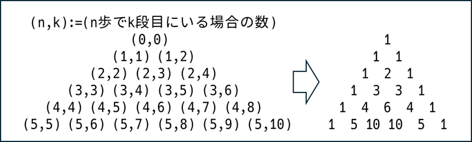
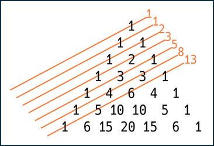
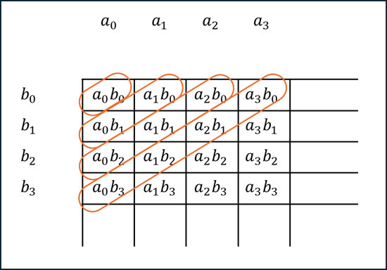
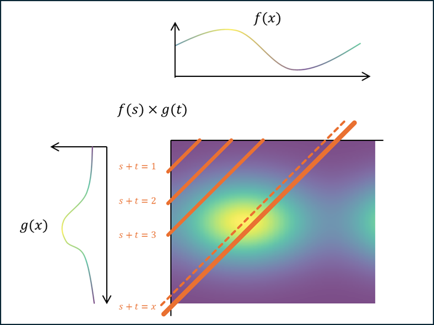

# 雑談

## 導入

教科書はもちろんのこと、数学の面白い話とかが載ってるブログとかでもあんまり対象化されてるのを見かけない話として、多項式と組み合わせ論の関係について紹介したいと思う。それから、この後何回も多項式の$x^{n}$の係数を考えることになるので、多項式$P$に対して$[P]_{x^{n}}$と書いた時に$P$の$x^{n}$の係数を表すことにする。

## 多項式と組み合わせ

まず、多項式と組み合わせ論と聞いて二項係数を思い出した諸兄は非常に勘がいい。ちなみにこの文において二項係数は$\binom{n}{k}$と記述することにする。二項係数というと定義としては組み合わせ論の文脈で、$\binom{n}{k}$は$n$個から$k$個を選ぶ場合の数とされており、式で書いてしまうと$\frac{n!}{k!(n-k)!}$となる。しかし、一部の人には「$(x+y)^{n}$の$x^{k}y^{n-k}$の係数（$=[(x+y)^{n}]_{x^{k}y^{n-k}}$）」という形で記憶している人も多いのではないだろうか。初歩的な話にはなるが、この2通りの解釈が一致する仕組みをまずは確認しようと思う。

まず$({\color{red}x}+{\color{blue}y})^{n}$を分配法則的に地道に計算することを考える。$n=2$の時は$({\color{red}x}+{\color{blue}y})({\color{red}x}+{\color{blue}y})$で、分配すると$({\color{red}x}\times{\color{red}x})+({\color{red}x}\times{\color{blue}y})+({\color{blue}y}\times{\color{red}x})+({\color{blue}y}\times{\color{blue}y})$なので$x^2+2xy+y^2$になる。$n=3$の時は$x^3+3x^2y+3xy^2+y^3$であり、$3{\color{red}x}^2{\color{blue}y}$の係数であるところの$3$は$({\color{red}x}\times{\color{red}x}\times{\color{blue}y})$と$({\color{red}x}\times{\color{blue}y}\times{\color{red}x})$と$({\color{blue}y}\times{\color{red}x}\times{\color{red}x})$の$3$つから来ていて、これは$(\square\times\square\times\square)$に${\color{red}x}$を$2$つと${\color{blue}y}$を$1$つを入れる場合の数が$3$通りあることを表している。
ここまで見れば分かる通り、一般に$[(x+y)^{n}]_{x^{k}y^{n-k}}$は$\square\times\square\times\cdots\times\square$で$\square$に$k$個の${\color{red}x}$と$(n-k)$個の${\color{blue}y}$を入れる場合の数になる。これはすなわち$n$個から（$x$が入る）$k$個を選ぶ場合の数と一致するという訳だ。

この仕組みは一般化できる。つまり例えば$p+q+r=n$とすると$[({\color{red}x}+{\color{blue}y}+{\color{green}z})^{n}]_{x^{p}y^{q}z^{r}}$は$\square\times\square\times\cdots\times\square$で$\square$に$p$個の${\color{red}x}$と$q$個の${\color{blue}y}$と$r$個の${\color{green}z}$を入れる場合の数であり、これは組み合わせ論によって$\frac{n!}{p!q!r!}$であることが分かっている。ちなみにこの様に「二項」ではなく「多項」になった値を多項係数と言ったりする。定理の形でいうなら多項定理だ。

上の例では$(x+y)$や$(x+y+z)$のべき乗といった分かり易い例を挙げたが、もう少しいびつな例を挙げておこう。$(x+y)(x+z)$という多項式を考える。これを展開すると$x^2+xz+xy+yz$となる訳だが、これを上の例に当てはめると、$(\square\times\square)$の$1$つ目の$\square$には$x$か$y$のいずれかが入り、$2$つ目の$\square$には$x$か$z$のいずれかが入る。ここで、$x^2$の係数が$1$なのは$x$を$2$回選ぶ様な場合の数が$1$であることを意味するし、$y^2$の項が存在しないのは$y$を$2$回選ぶ様な場合の数が$0$であることを意味している。

今までは多項式が組み合わせ的に解釈できることを表したが、今度は逆に組み合せ論の話を多項式で表してみよう。例えばそれぞれ${\color{red}a},{\color{blue}b},{\color{green}c}$と書いてある$3$個のボールがあるとして、$1$回目は${\color{red}a}$のボールと${\color{blue}b}$のボールのどちらかを選び、$2$回目は${\color{blue}b}$のボールと${\color{green}c}$のボールのどちらかを選び、$3$回目は${\color{green}c}$のボールと${\color{red}a}$のボールのどちらかを選ぶとする。これに対応する多項式を考えると、まず$3$回選ぶのだから多項式を展開する際に行われる掛け算は$\square\times\square\times\square$という形で、$1$番目の$\square$には${\color{red}a}$か${\color{blue}b}$のいずれかが入り、$2$番目の$\square$には${\color{blue}b}$か${\color{green}c}$のいずれかが入り、$3$番目の$\square$には${\color{green}c}$か${\color{red}a}$のいずれかが入るという感じになって欲しい。これを実現する多項式は$({\color{red}a}+{\color{blue}b})({\color{blue}b}+{\color{green}c})({\color{green}c}+{\color{red}a})$になることが分かる。最初の$({\color{red}a}+{\color{blue}b})$は$1$回目の選択を表し、次の$({\color{blue}b}+{\color{green}c})$は$2$回目の選択を表している。

以上は組み合わせ論の問題をそれと対応する多項式で表現する例になっている。いずれの場合においても、組み合わせ論における「選ぶ」という試行が、多項式においては選ぶ対象の和をかけるということに相当している（$x$と$y$のうちから片方を選ぶということが$(x+y)$をかけるということに相当するように）。

さらに一般化してみよう。次は$\{0, 1, 2\}$の中から$1$個選ぶという試行を$n$回繰り返した時の場合の数を考えてみる。となると、今回対応する多項式は$(x_0+x_1+x_2)$の$n$乗ということになりそうだ。
ここから選んだ数の総和が$k$になる場合の数を考えてみよう。$n=3, k=2$で考えると、$(x_0+x_1+x_2)^3$における添字の総和が$2$となる項（$x_{0}^{2}x_{2}$と$x_{0}x_{1}^{2}$）の係数を考えれば良さそう。でも複数の項を調べるのは面倒だし、それらの項がまとまるような仕組みがあれば楽ができる。そこで$x_0\mapsto 1, x_1\mapsto x, x_2\mapsto x^2$と変換してみよう。すると添字の総和が$x$の指数に集約され、$[(1+x+x^2)^3]_{x^2}$が求めたい答えになる。

## フィボナッチ数列とともに

この洞察をフィボナッチ数列に関する有名問題に適用してみよう。まずは以下の問題について考えてみる。

> 問
> $n$段の階段があり、これを登る方法の場合の数を調べたい。ただし、あなたは$1$歩で$1$段または$2$段登ることができる。
> 例えば、$n=3$の時の登り方は$1$歩目: $1$段, $2$歩目: $1$段, $3$歩目: $1$段と、$1$歩目: $1$段, $2$歩目: $2$段と、$1$歩目: $2$段, $2$歩目: $1$段の$3$通りが存在するため、答えは$3$になる。

結論から言うとこの問題の解答はフィボナッチ数列になる。具体的に列挙すると、この問題の解答は$n=0$から順に$1, 1, 2, 3, 5, 8, 13, \cdots$となる。この問題の一般的な解法は以下のようになる。

> 解答を$a_n$と書くことにする。
> まず、$a_0=1, a_1=1$となる（これは各自確認すること）。$n>1$の時、$1$歩目は必ず$1$段目か$2$段目になるので、そこで場合分けを行う。
>
> 1. $1$歩目が$1$段目の時
> 残りは$(n-1)$段なので$a_{n-1}$通りになる。
> 2. $1$歩目が$2$段目の時
> 残りは$(n-2)$段なので$a_{n-2}$通りになる。
>
> パターン$1$とパターン$2$はそれぞれ被り無く全体を網羅している様な場合分けになっていることに留意して欲しい。
> したがって、$a_n=a_{n-1}+a_{n-2}$となり、これはフィボナッチ数列の漸化式と一致している。

まぁこの後はこの漸化式を解いて一般項の閉じた表現を求めてもらっても構わないが、今回の主眼はそこではない。この問題を多項式で表現してみようという訳だ。
今回は$1$段と$2$段を選び、最終的に登った段数の総和を得る訳だから、$x+x^2$を何度もかけていけば良いということが直感できる。が、単に$[(x+x^2)^{m}]_{x^{n}}$を考えると、これは$m$歩目に$n$段目にいる場合の数になる。今回は歩数の制限はないため、何歩でも良いから$n$段目にいる場合の数を求めたい。つまり、「$0$歩目で$n$段目にいる場合の数」$+$「$1$歩目で$n$段目にいる場合の数」$+$「$2$歩目で$n$段目にいる場合の数」$+\cdots$を計算すれば良いので、求めるのは以下となる。

$$
\begin{aligned}
a_n &= \left[(x+x^2)^{0}\right]_{x^{n}}+\left[(x+x^2)^{1}\right]_{x^{n}}+\left[(x+x^2)^{2}\right]_{x^{n}}+\cdots \\
&= \sum_{m=0}^{\infty}\left[(x+x^2)^{m}\right]_{x^{n}} \\
&= \left[\sum_{m=0}^{\infty}(x+x^2)^{m}\right]_{x^{n}}
\end{aligned}
$$

無限和にはなっているが$m>n$における$(x+x^2)^{m}$は$x^{n}$の係数には影響しないので、実際は$m\leq n$の範囲で計算すれば十分である。が、とりあえず無限和として考えてみるとこれは初項$1$で公比$x+x^2$の等比級数なので、計算結果は$\frac{1}{1-x-x^2}$となる。つまり、先の結果と合わせると$a_n=\left[\frac{1}{1-x-x^2}\right]_{x^{n}}$となるため、以下が分かる。

$$
\begin{aligned}
\frac{1}{1-x-x^2} &=& a_0 &+& a_1x &+& a_2x^2 &+& a_3x^3 &+& a_4x^4 &+& a_5x^5 &+& a_6x^6 &+& \cdots \\
&=& 1 &+& x &+& 2x^2 &+& 3x^3 &+& 5x^4 &+& 8x^5 &+& 13x^6 &+& \cdots
\end{aligned}
$$

これはフィボナッチ数列の（通常型）母関数に他ならない。特に、$(x+x^2)^{m}$は二項定理を使って展開すると$\sum_k\binom{m}{k}x^{m+k}$と表現できる。$m$歩目に$n$段目にいる場合の数はこれの$x^{n}$の係数、つまり$\binom{m}{n-m}$になる。これを$m$について総和を取ると$a_n$になるのだから、以下のように表現できることが分かる。変な定理だ。

$$
\begin{aligned}
a_n &= \sum_{m=0}^{\infty}\left[\sum_{k=0}^{m}\binom{m}{k}x^{m+k}\right]_{x^n} \\
&= \sum_{m=0}^{\infty}\binom{m}{n-m}
\end{aligned}
$$

ただし、$\binom{n}{k}$は$n<k$または$k<0$の時、$0$になるものとする。

この問題と二項係数とフィボナッチ数列の関係を図示すると以下になる。

## 場合の数から確率に

もう少し遊んでみよう。毎歩$1$段登るか$2$段登るかがそれぞれ確率$1/2$でランダムであるとする。そして登っている最中に$n$段目を踏んだと仮定する。この時、その$n$段目を踏んだ瞬間の歩数の期待値がどうなるのかを計算してみよう。
方針としては「$m$歩目で$n$段目にいる確率」を求めて、それを$m$倍して総和を取れば良さそうだ。そこで「$m$歩目で$n$段目にいる確率」を各$m,n$に対して観察してみよう。まず$0$歩目では$0$段目にいる確率が$100\%$だが、これはどうでもいい。$1$歩目では$0$段目にいる確率が$0$で、$1$段目と$2$段目にいる確率がそれぞれ$1/2$である。$1$歩目時点での各段目に居る確率の分布を見ると$(0,\frac{1}{2},\frac{1}{2},0,\cdots)$という感じだと言える。同様に計算すると$2$歩目の分布は$(0,0,\frac{1}{4},\frac{2}{4},\frac{1}{4},0,\cdots)$となる。$3$歩目は$(0,0,0,\frac{1}{8},\frac{3}{8},\frac{3}{8},\frac{1}{8},0,\cdots)$となる。なんとなく、$\left(\frac{1}{2}x+\frac{1}{2}x^2\right)^{m}$の係数になってることが分かるだろうか。係数に$\frac{1}{2}$という補正を入れることで$x$と$x^2$を選んだ場合の数が確率になるということである。この機序を説明してみようと思う。
例えば$2$歩目の場合に$3$段目にいる確率は$\frac{1}{2}$であるが、これは($1$歩目で$1$段登る確率)$\times$($2$歩目で$2$段登る確率)$+$($1$歩目で$2$段登る確率)$\times$($2$歩目で$1$段登る確率)$=\frac{1}{2}\times\frac{1}{2}+\frac{1}{2}\times\frac{1}{2}=\frac{1}{2}$と計算される。この「$1$歩目」と「$2$歩目」というそれぞれの試行においてあり得る選択のペア（つまり$(1段,2段)$と$(2段,1段)$）の確率をかけて和を取るという操作を行っているのだが、この「かけて和を取る」という操作は多項式の掛け算と同じ操作になっている。つまり先述の確率の計算は、$\left(\frac{1}{2}x+\frac{1}{2}x^2\right)^2$の展開における$\square\times\square$の$1$個目の$\square$と$2$個目の$\square$に入る項の選び方において、$(\frac{1}{2}x,\frac{1}{2}x^2)$と選んだ場合と$(\frac{1}{2}x^2,\frac{1}{2}x)$と選んだ場合の係数の和を取る操作に対応し、したがって計算結果である確率は$\left[\left(\frac{1}{2}x+\frac{1}{2}x^2\right)^{2}\right]_{x^3}$と一致するということなのである。したがって余談ではあるが、これは例えば$1$段登る確率が$1/3$で$2$段登る確率が$2/3$だという場合は$\left(\frac{1}{3}x+\frac{2}{3}x^2\right)^{m}$の係数を見れば良いというような形で一般化もできる。
話を元に戻すと、求めたいのは歩数の期待値であった。だから、(歩数)$\times$(確率)の総和を取れば良い。「$m$歩目で$n$段目にいる確率」は$\left[\left(\frac{1}{2}x+\frac{1}{2}x^2\right)^{m}\right]_{x^{n}}$の係数だったのだから、求める値は以下になる。

$$\sum_{m=0}^{\infty}m\left[\left(\frac{1}{2}x+\frac{1}{2}x^2\right)^{m}\right]_{x^{n}}=\left[\sum_{m=0}^{\infty}m\left(\frac{1}{2}x+\frac{1}{2}x^2\right)^{m}\right]_{x^{n}}$$

しかし、実はこの議論には$2$個の嘘が混じっている。見抜けなかった諸兄は今後騙されないように気をつけてください。まず$1$個目の嘘は、そもそもこのそれぞれの「$m$歩目で$n$段目にいる確率」は、「$1$歩進んだ時」と「$2$歩進んだ時」と「$3$歩進んだ時」…とそれぞれの試行ごとにおいて計算した確率になのだから、そのまま足すのは議論としては不味い。「確率$1/2$のコインを$2$枚投げたんだからどちらかが表になる確率は$100\%$」くらいの暴論である。ただし今回は、$m$歩目で$n$段目にいて$m'(\neq m)$歩目でも$n$段目にいるということがありえない（各$m$における$n$段目にいるという事象が排反である）ため、そのまま総和を取っても問題ない。$2$個目の嘘は、そもそも$n$段目を踏まない事象を考慮できていないということだ。つまり、求めるべきなのは$n$段目を踏む条件付き確率であるのだから、正しくは以下である。

$$\frac{\displaystyle \left[\sum_{m=0}^{\infty}m\left(\frac{1}{2}x+\frac{1}{2}x^2\right)^{m}\right]_{x^{n}}}{\displaystyle \left[\sum_{m=0}^{\infty}\left(\frac{1}{2}x+\frac{1}{2}x^2\right)^{m}\right]_{x^{n}}}$$

分母は$n$段目を踏む確率を表している。ちなみに詳しくは解説しないが、分子の無限和は$\frac{x(x+1)}{(x+2)^2(x-1)^2}$となる（$\sum _{m}mx^{m}=x/(1-x)^2$という定理を使う）。これを部分分数分解すれば単純な式になるので、各項の$x^n$の係数を閉じた式で記述することができる。すると最終的に$\left[\sum_{m}m\left(\frac{1}{2}x+\frac{1}{2}x^2\right)^{m}\right]_{x^{n}}$も閉じた式で書けるという寸法である。それ以上は単なる計算なので今回はやらない。やりたい人はやってください。

## 離散から連続に

この問題は実はさらに発展させることが可能だ。階段のような離散的な数値ではなく、平らな道を想像してほしい。この道を何歩で踏破できるのかを考えるという問題設定をしてみる。ただし、一歩の距離は$[0, 1]$閉区間で一様に分布するものとする。問題を離散から連続にするうえで多項式の掛け算は関数の畳み込みに変化することになる。これを直感的に説明してみようと思う。

そもそもなぜ多項式が組み合わせ論において有用であったのかを考えると、ひとえに多項式の掛け算が「あり得る全てのペアを網羅」して、「同じ要素のものは$1$つの項の係数にまとめる」という面倒くさい処理を肩代わりしてくれるからであった。例えば$2$個の多項式$P(x)=a_0+a_1x+a_2x^2+\cdots$と$Q(x)=b_0+b_1x+b_2x^2+\cdots$の積の$x^3$の係数を考えると$a_0b_3+a_1b_2+a_2b_1+a_3b_0$となるが、これは足して$3$になるペアを網羅して$x^3$という$1$つの項の係数にまとめたものに他ならない。式で書くなら以下を計算してくれているという具合だ。

$$足してnになるペアの総和: \sum_{k+l=n}a_kb_l$$

これが連続になるとどうなるかというと、今まで$a_0,a_1,a_2,\ldots$と離散的だった数列は$f(x)$のような連続な関数に変化する（添字だったものが変数になるイメージ）。それを踏まえて「足して$3$になるすべてのペアの総和」というものを考えると、$\int_{s+t=3}f(s)g(t)$のように計算できる。上の図と同じように書くとこうだ。

$$足してxになるペアの総和: \int_{s+t=x}f(s)g(t)$$

上記のような計算を数学では関数の畳み込みと呼ぶ。
さて、元の問題では一歩の距離は$[0, 1]$閉区間で一様に分布するということだった。これを関数にするとどんな関数になるだろうか？多項式の時は$x^n$の係数は$n$段目にいる確率だった。それで言うと、$f(x)$は距離$x$にいる確率と言いたいが、ピッタリ距離$x$を踏む確率は$0$だ。なので、確率そのものではなくて確率の分布を見ることにする。イメージとしては$f(x)$の値は距離$x$付近にいる確率みたいなノリだ。つまり、考えるべき関数$f$は閉区間$[0, 1]$上で$1$を取り、それ以外では$0$であるような矩形関数の亜種になる。ちなみにこのような関数は閉区間$[0, 1]$の指示関数もしくは定義関数と呼ぶ。確率論の言葉では、今回の分布の確率密度関数とも言う。
$m$歩目次点での確率密度関数は$f$を$m$回畳み込んだ$f*f*\cdots*f=f^{*m}$となる。したがって離散の場合と同じアナロジーで考えると、求める期待値は以下になると考えられる。

$$\sum_{m=0}^{\infty} m f^{*m}(x)$$

で、これも離散の時に発生した嘘について考える必要がある。まず足してる事象は排反であるかということについてだが、これは問題ないと思っている。少なくとも$m$歩目で距離$x$にいて$m'(\neq m)$歩目でも距離$x$にいるということがありえない（確率が$0$だ）と言えるだろう。次に距離$x$を踏まない場合を考えられていないかということだが、そもそもピッタリ距離$x$を踏む確率自体は$0$なので議論としてはそのまま$\sum_{m}f^{*m}(x)$で割るというのは怪しく見えるが、あくまで分布を考えている訳なのでとりあえずそれで良さそうだ。
まだ気になるという人はこう考えてみたら良いと思う。そもそも確率密度関数の実態は細分化した短冊状の関数であり、各短冊の面積がその短冊の範囲内にはいる確率に対応しているのだ。すると、各$m$に対応した短冊の面積の総和（$\sum_{m}f^{*m}(x)$）はその範囲に入る確率を表していると言えるだろう。だから条件付き確率を考えるなら$\sum_{m}f^{*m}(x)$で割る必要がある。
とにかく最終的に以下の式で表される。

$$\frac{\displaystyle \sum_{m=0}^{\infty}mf^{*m}(x)}{\displaystyle \sum_{m=0}^{\infty}f^{*m}(x)}$$

…というのが自分の予想だ。これは別に正しい式じゃないだろうし、そもそもピッタリ距離$x$を踏む確率自体が$0$なのに、その時の歩数の期待値ってのも正直意味分からん。自分で何を計算しているのか分からない。が、あながち間違いではないんじゃないかな、と思ってる。果たして。

## 余談1

この$f^{*m}$はIrwin–Hall分布という名前が付いていて、以下の式になるらしい。

$$f^{*m}(x)=\frac{1}{(m-1)!}\sum_{k=0}^{\lfloor x\rfloor}(-1)^{k}\binom{m}{k}(x-k)^{m-1}$$

ここから、閉区間$[0,1]$上では$\lfloor x\rfloor=0$なので$\sum_{m}f^{*m}(x)=e^x$が分かる。美しい。

## 余談2

$B$という条件における$A$の条件付き確率は以下の式で求められている。

$$
\operatorname{P}(A\mid B)={\frac{\operatorname{P}(A\cap B)}{\operatorname{P}(B)}}
$$

しかしこれは${\operatorname{P}(B)}=0$の時を考慮していない。まさに最後の方で言及していた「そもそもピッタリ距離$x$を踏む確率自体が$0$なのに、その時の歩数の期待値ってのも正直意味分からん」って話である。一応条件となる事象の確率が$0$の場合の条件付き確率や条件付き期待値については既に研究があって、この場合はなんか分からんがラドン＝ニコディム微分というものを使ってより厳密な意味における条件付き期待値を定義できるらしい。ほぇ～。
関連する話としてボレル＝コルモゴロフのパラドックスという話があるらしい。ちょっと見てみたけど、なるほどという感じ。
