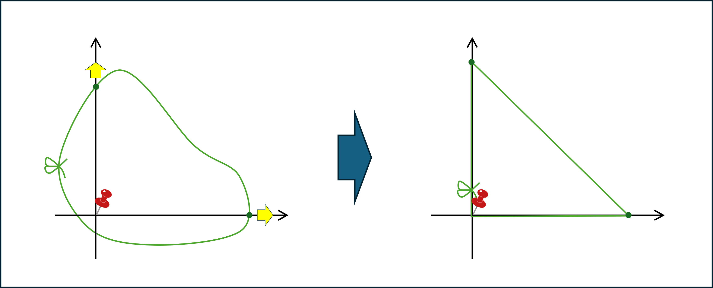
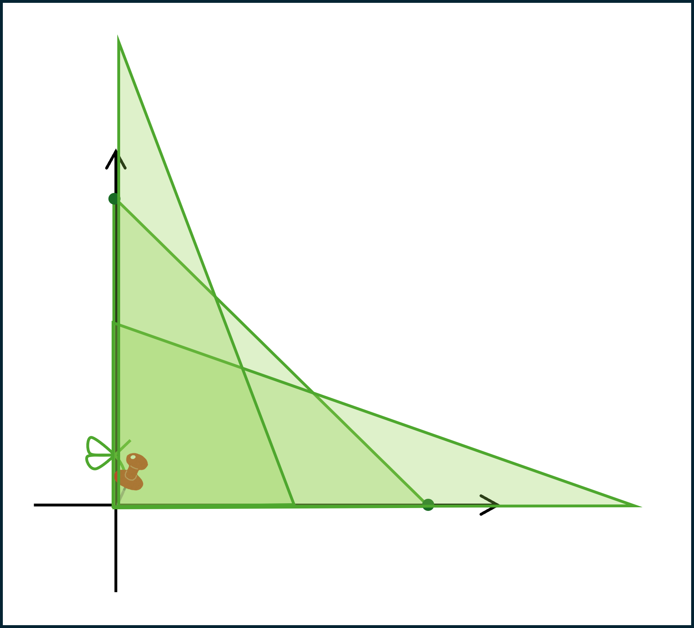
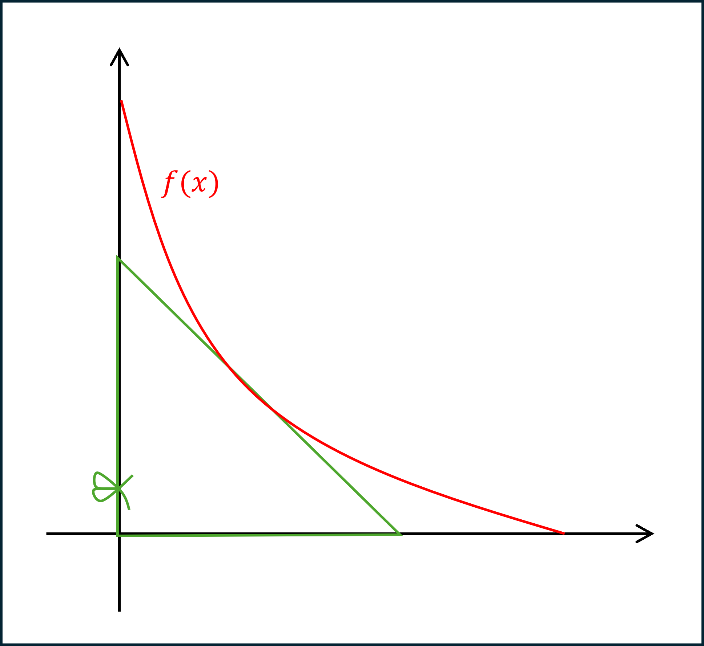
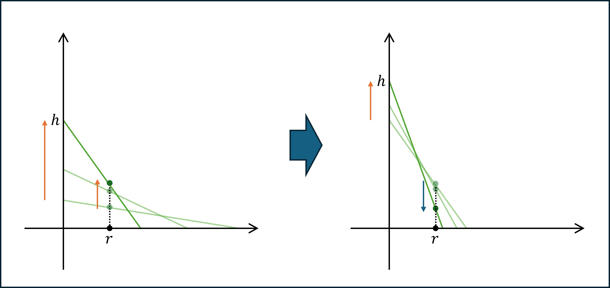
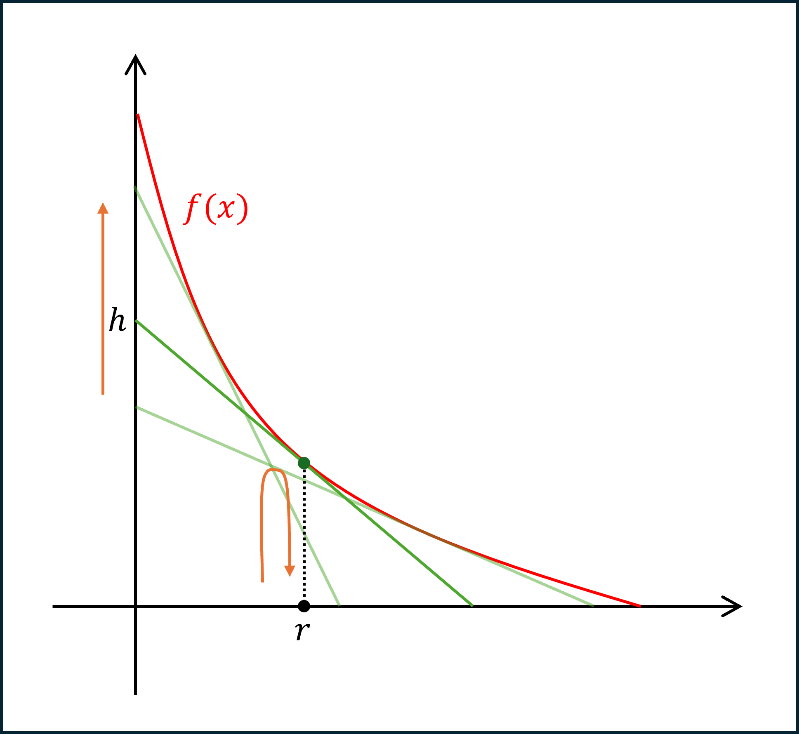
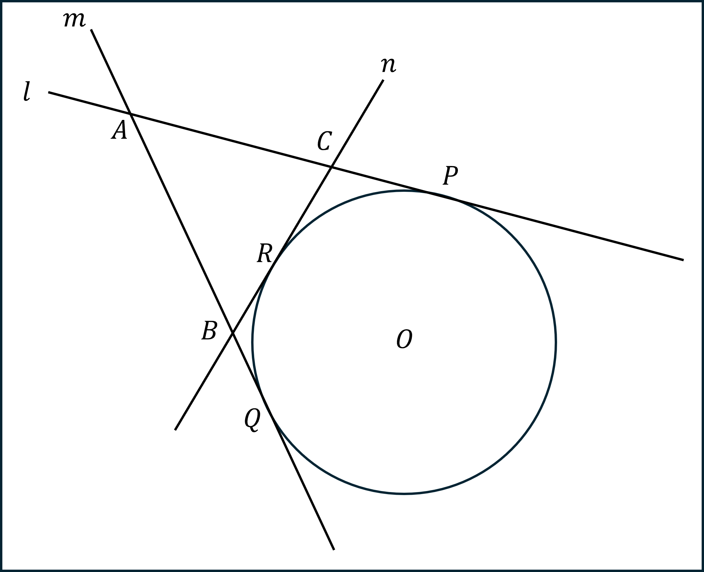
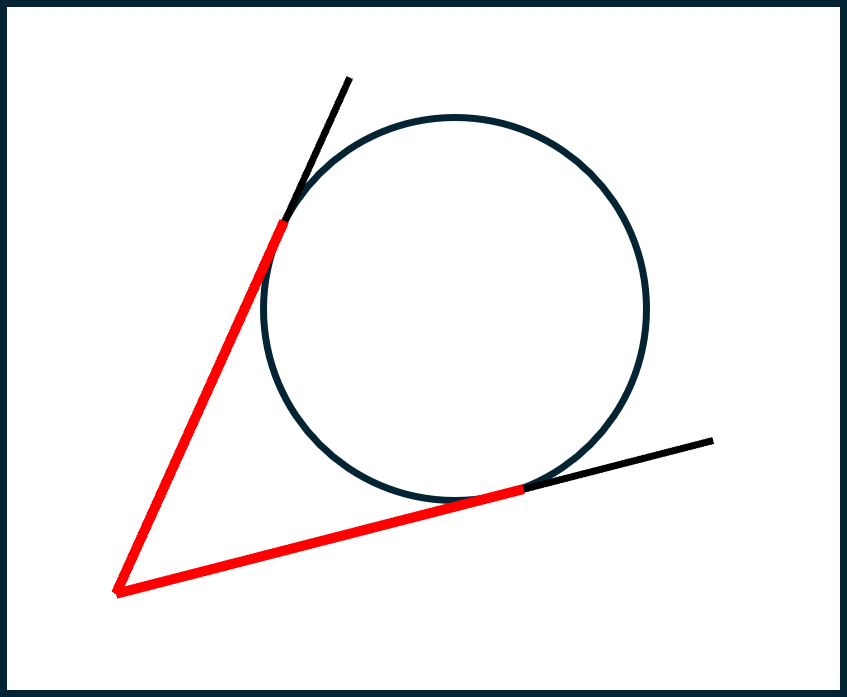
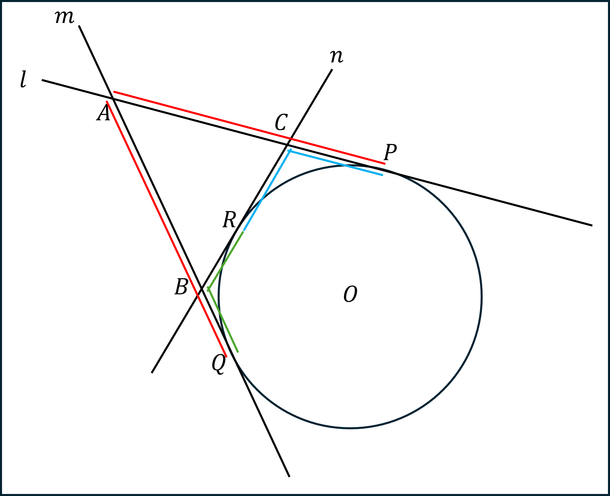

# 雑談

詳しい時期は覚えてないが、大学の学部生の時に暇つぶしで解いた問題が面白かったのを思い出した。最近、その問題の綺麗な解答を思い付いたのでそれを共有しようと思う。以下のような問題だ。

平面の世界を考える。伸び縮みしない紐を用意してこれを固く結んで輪っかを作った。すると、輪っかの一周の長さは$2$であることが分かった。その輪っかを原点を含むように置いておき、原点にピンを刺しておいた。その状態で、輪っかの$2$点を掴んでそれぞれ$x$軸正の方向と$y$軸正の方向に引っ張ってピンと張り、$x$軸と$y$軸に沿う様に直角三角形を作った。

この様な三角形は何通りかあると思うが、その様な三角形によって囲まれ得る範囲を考えよ。

まず、答えとしては以下のような赤い曲線の下側になりそうだという直感は良いだろうか。これが$y=f(x)$という関数のグラフで表されているものとして考える。

問題の方法で作成されるどんな三角形の斜辺も常に曲線$y=f(x)$に接していると考えられる。ちなみに、この様な曲線を包絡線と言う。「包絡線」で画像検索すると色々出てきて楽しいよ。
次に、この直角三角形の高さを$h$、幅を$w$とする。したがって、$h+w+\sqrt{h^{2}+w^{2}}=2$である。この式を$(\star)$と名付けておく。$h$が決まれば式$(\star)$によって$w$も自動的に決定されるため、この三角形は$1$個の実数によってパラメトライズされていると言える。また、斜辺は$\frac{x}{w}+\frac{y}{h}=1$という$1$次式によって記述される。もちろんこれは曲線$y=f(x)$の下側で接している。
さて、この斜辺は高さ$h$が$0$に近い時はほぼ$x$軸に沿う形になっていて、$h$が最大値（$=1$）に近い時はほぼ$y$軸に沿う形になる。関数$f$を求めるために、$h$が$0$から$1$に変化していく際に、固定された実数$r$から見て斜辺の高さがどう変化するのかを確認してみよう。つまり、以下のような状況を考えたい。

まず最初は$h$が増えるにしたがって、点$(r,0)$から見て斜辺は高くなっていく。しかし、あるタイミングを境に$h$が増えても斜辺は低くなっていくように見えて、やがて斜辺の外側に出てしまう。この**あるタイミング**というのがまさしく斜辺が$x=r$で曲線$y=f(x)$に接したタイミングに他ならないのではないだろうか。つまり、以下のように斜辺が曲線$y=f(x)$に接しながら縦向きになっていく様子を考えると、$x$座標が$r$に固定された点の動きは$y=f(x)$に$(r,f(r))$で接したタイミングで最大値を取るはずなのだ。

したがって、求める$f(x)$は$h$を$0$から$1$まで変化させた時の$x=r$における斜辺の高さ$h\left(1-\frac{r}{w}\right)$の最大値に他ならない。$h$と$w$は式$(1)$に従う必要があるということを踏まえると先程の式は$h$と$r$のみに依存する関数であるため、これを$H_{r}(h)$と書くことにする。後は、$H_{r}(h)$を$h$で微分して増減表を書き最大値を求めればそれが$f(r)$となるが、$w$が邪魔なので以下のような計算をしておく。

$$
\begin{aligned}
h+w+\sqrt{h^{2}+w^{2}} &= 2 \\
-2+h+w &= -\sqrt{h^{2}+w^{2}} \\
(-2+h+w)^{2} &= h^{2}+w^{2} \\
4-4h-4w+2hw &= 0 \\
(2-h)(2-w) &= 2 \\
w &= -\frac{2}{2-h}+2 &&= \frac{2(1-h)}{2-h}
\end{aligned}
$$

したがって$H_{r}(h)=h\left(1-\frac{r(2-h)}{2(1-h)}\right)=\frac{h(2(1-r)-(2-r)h)}{2(1-h)}$となる。

$$
\begin{aligned}
\frac{d}{dh}H_{r}(h) &= \frac{(2(1-r)-2(2-r)h)(2(1-h))-(h(2(1-r)-(2-r)h))(-2)}{4(1-h)^{2}} \\
&= \frac{1}{2(1-h)^{2}}(2((1-r)-(2-r)h)(1-h)+(h(2(1-r)-(2-r)h))) \\
&= \frac{1}{2(1-h)^{2}}(2(1-r)-2(3-2r)h+2(2-r)h^{2}+2(1-r)h-(2-r)h^{2}) \\
&= \frac{1}{2(1-h)^{2}}(2(1-r)-2(2-r)h+(2-r)h^{2}) \\
\end{aligned}
$$

計算がダルい。が、次もダルいぞ！$\frac{d}{dh}H_{r}(h)=0$と$2(1-r)-2(2-r)h+(2-r)h^{2}=0$が同値ということが分かったのでこれを解く。地道に！

$$
\begin{aligned}
2(1-r)-2(2-r)h+(2-r)h^{2} &= 0 \\
h &= \frac{2-r\plusmn\sqrt{(2-r)^{2}-2(2-r)(1-r)}}{2-r} \\
h &= \frac{2-r\plusmn\sqrt{r(2-r)}}{2-r} \\
h &= 1\plusmn\frac{\sqrt{r(2-r)}}{2-r}
\end{aligned}
$$

したがって、$h=1\plusmn\frac{\sqrt{r(2-r)}}{2-r}$の時に$\frac{d}{dh}H_{r}(h)=0$となり、そのいずれかのタイミングで$x=r$における点が下へ移動し始める訳だ。が、今考えている$h$と$r$は$1$未満の正の実数であるはずだということを考えれば$h=1-\frac{\sqrt{r(2-r)}}{2-r}$が求めたいタイミングであることが分かる。このタイミングで斜辺は曲線$y=f(x)$と$x=r$で接しているため、$f(r)=H_{r}(h)$となる。つまり、以下のようになる。ダルい計算はこれが最後だ！

$$
\begin{aligned}
f(r) &= H_{r}(h) \\
&= H_{r}\left(1-\frac{\sqrt{r(2-r)}}{2-r}\right) \\
&= \frac{\left(1-\frac{\sqrt{r(2-r)}}{2-r}\right)\left(2(1-r)-(2-r)\left(1-\frac{\sqrt{r(2-r)}}{2-r}\right)\right)}{2\frac{\sqrt{r(2-r)}}{2-r}} \\
&= \frac{\left(2-r-\sqrt{r(2-r)}\right)\left(-r+\sqrt{r(2-r)}\right)}{2\sqrt{r(2-r)}} \\
&= \frac{-r(2-r)+2\sqrt{r(2-r)}-r(2-r)}{2\sqrt{r(2-r)}} \\
&= 1-\sqrt{r(2-r)}
\end{aligned}
$$

よってようやく$f(r)=1-\sqrt{r(2-r)}$ということが分かったので、曲線$y=f(x)$の正体は$y=1-\sqrt{x(2-x)}$だった訳だ。もう少し綺麗な形になるように式変形してみよう。

$$
\begin{aligned}
y &= 1-\sqrt{x(2-x)} \\
(y-1)^{2} &= 2x-x^{2} \\
(y-1)^2+x^2+2x+1 &= 1 \\
(x-1)^{2}+(y-1)^{2} &= 1
\end{aligned}
$$

ということで、実はこの曲線は$(1,1)$を中心とする半径$1$の円弧だった訳である。実際に$\frac{x}{w}+\frac{y}{h}=1$と点$(1,1)$の距離を求めてみよう。点と直線の距離の式を使えば、それは$\frac{|\frac{1}{w}+\frac{1}{h}-1|}{\sqrt{\frac{1}{w^{2}}+\frac{1}{h^{2}}}}$と書ける。分母分子を$hw$倍してみるとこれは$\frac{|h+w-hw|}{\sqrt{h^{2}+w^{2}}}$となる。式$(\star)$を変形した際に$hw-2h-2w+2=0$が得られたことを思い出すと、分子は$h+w-hw=2-h-w$となって分母も$\sqrt{h^{2}+w^{2}}=2-h-w$となるので、確かに$1$になる。最初にこれに気づいていればあのダルい微積分をする必要もなかったのだ！

というのが学部生の頃の思い出。最近になって思い付いた綺麗な解答というのは最後の点と直線の距離を使った解法、ではない。もっと綺麗な解答を思い付いたのだ。初等幾何しか使わない。

まず、円$O$とそれに接する$2$本の平行ではない直線$l,m$を考える。先の問題ではそれが$x$軸と$y$軸に相当する。この円にさらに接線$n$を追加する。ただし、$3$本の接線$l,m,n$がなす三角形の中に円が入らないようにする。$l,m$の交点, $m,n$の交点, $n,l$の交点をそれぞれ$A,B,C$として、また接線$l,m,n$の接点をそれぞれ$P,Q,R$とする。この時、$\triangle ABC$の周長（$=AB+BC+CA$）は$2AP$に等しくなるということを証明したい。特に、周長は直線$n$の取り方に依らないということが言える。

まず前提として、円に対して円の外側の点を選んで、そこから円に向かって引いた$2$本の接線の接点までの距離は等しくなる。この定理を使えば$\triangle ABC$の周長はもう少し簡単に書ける。

まず点$A$から見てみると、円$O$に$l,m$という$2$本の接線が伸びている。ここから言えるのは$2AP=AP+AQ$ということだろう。次に点$B$から見てみると$BR=BQ$が言える。同様に点$C$から$CR=CP$となる。分かりやすく図示すると以下のような感じだ。同じ色は同じ長さを表している。

したがって、$AB+BC+CA=(AB+BR)+(AC+CR)=AP+AQ=2AP$。これを最初の問題に適用すると、周長が$2$で一定になる様に斜辺の角度を変える時、その斜辺は常に残りの$2$辺に$(1,0)$および$(0,1)$でそれぞれ接するような円に接するように動くので、直角三角形が包含する範囲はその下側であるということが分かる。この解法では方程式を解く必要すら無い！

こういうエレガントな解法って最初は思い付かないものだし、答えが分かってから思い付いても一般性に欠けてるとかであまり反芻しないことが多いけれど、実際は新たな問題への洞察を導くことも多いし、最初からこれが思い付くにはどうすれば良いんだろうか？と考えることは、問題に対する姿勢を一段階俯瞰した視点から眺めることができるので、「閃き」とか「直感」で片付けていたものを再現性のあるものにする上でとても大事なことだと思う。

## 余談

この話を書いてたら、$3$次元だとどうなるか気になってきた。3次元だと、表面積で考えるだとか各辺の長さの和で考えるだとか、逆に結論が円になる様な条件を考えてみるだとか、色んな発展型が考えられそうだね。
