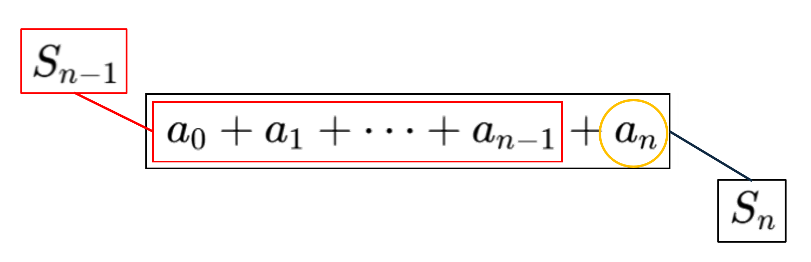
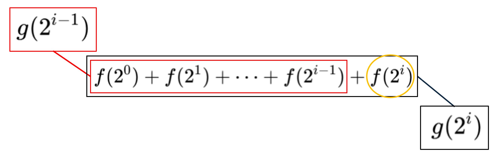
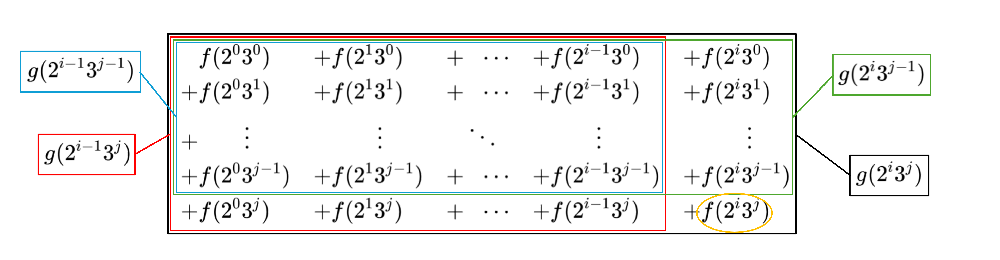
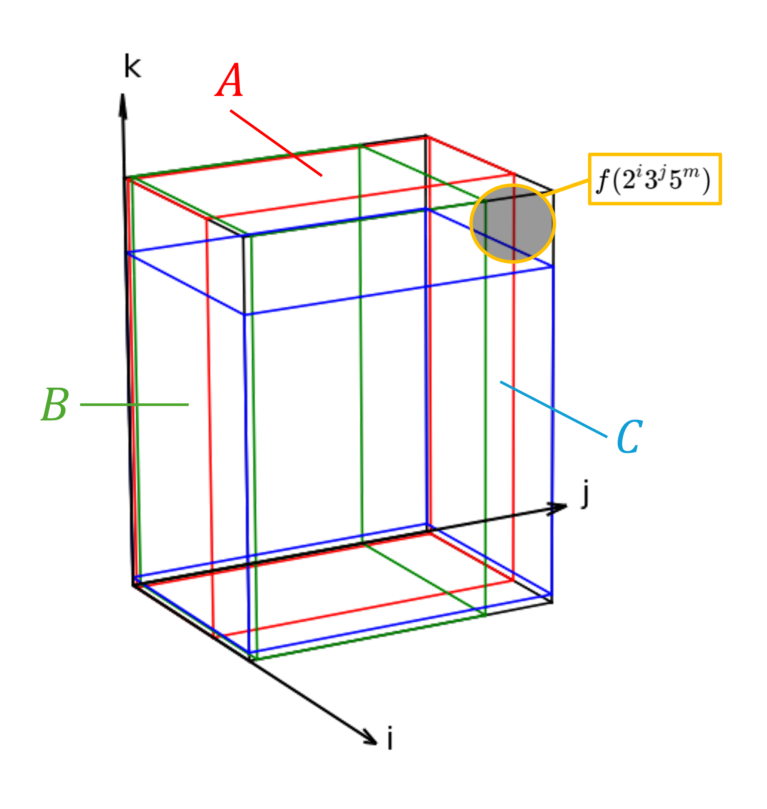
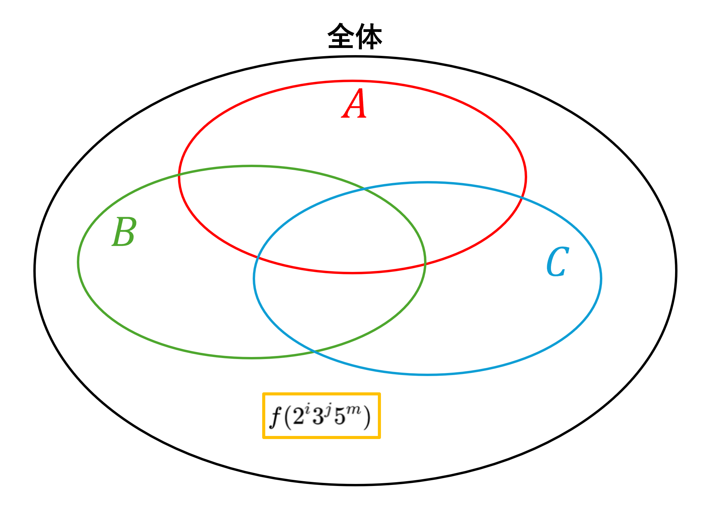
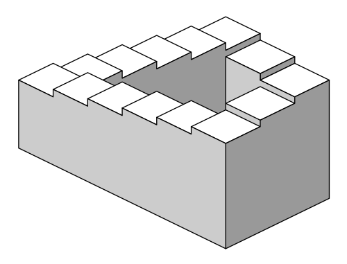

# 雑談

メビウスの反転公式という定理がある。関数$f,g$に対して以下が成り立つというものだ。

$$
g(n)=\sum_{d\mid n}f(d)\iff f(n)=\sum_{d\mid n}g(d)\mu\left(\frac{n}{d}\right)
$$

ちなみに$d\mid n$というのは$d$が$n$を割り切るという意味であり、ここでは$n$のすべての約数$d$に対して総和を取るという意味になる。また、ここで$\mu$はメビウス関数のことであり、以下で定義される。

$$
\mu(n)=
\begin{cases}
    1 & \text{if $n=1$} \\
    (-1)^{k} & \text{if $n$が$k$個の相異なる素因数の積である} \\
    0 & \text{if $n$が平方因子を持つ}
\end{cases}
$$

なんだこのキショい定義は！という声はご尤もだが、ひとまず置いておく。大事なのは$1$か$-1$か$0$しか出ないという点。つまり、$\sum g(d)\mu\left(\frac{n}{d}\right)$ってのは$g(d)$を足したり引いたり無視したりしているということだ。なんかそう考えるとこの公式に似たものをどこかで見た記憶が…ハッ！

$$
S_{n}=\sum_{k=0}^{n}a_n\iff a_{n}=S_{n}-S_{n-1}
$$

（$n=0$の辺りとかの処理はよしなにやってほしい）
確かにこれと比較すると何かこう、似ている話をしている気がしてきた！これ自体は$a_n$の総和が得られている時は、$n$項目までの総和から$n-1$項目までの総和を引けば$n$項目が得られるという話だ。図で書くとこんな感じ。

同じ様に$g$が$f$の和として与えられている時に$g$を使って$f$を得るにはどうしたら良いのか？という視点で見てみよう。
例えば$n=2^{i}$と書ける場合は$g(2^{i})=f(2^0)+f(2^1)+\cdots+f(2^{i})$なので、$f(2^{i})=g(2^{i})-g(2^{i-1})$となる。これは$S_{n}$と$a_{n}$の関係と一致する。

$n=2^{i}3^{j}$と書ける場合はどうだろうか？以下のような図を考えれば簡単に計算できる。

すなわち、$f(2^{i}3^{j})=(全体)-(赤枠)-(緑枠)+(青枠)=g(2^{i}3^{j})-g(2^{i-1}3^{j})-g(2^{i}3^{j-1})+g(2^{i-1}3^{j-1})$となる。どうでしょう。何となく見えてきたんじゃないですか？
$n=2^{i}3^{j}5^{k}$は？以下の図を考える。

まず$2$の指数が$i-1$以下の箇所を$A$、$3$の指数が$j-1$以下の箇所を$B$、$5$の指数が$k-1$以下の箇所を$C$とすると、全体から$A,B,C$を引く必要があって、それだと$A$かつ$B$と$B$かつ$C$と$C$かつ$A$が$2$回引かれてるから足してやる必要があって、それだと$A$かつ$B$かつ$C$が残ってしまうから引く必要がある。つまり、$f(2^{i}3^{j}5^{m})=(全体)-A-B-C+(A\cap B)+(B\cap C)+(C\cap A)-(A\cap B\cap C)=g(2^{i}3^{j}5^{m})-g(2^{i-1}3^{j}5^{m})-g(2^{i}3^{j-1}5^{m})-g(2^{i}3^{j}5^{m-1})+g(2^{i-1}3^{j-1}5^{m})+g(2^{i}3^{j-1}5^{m-1})+g(2^{i-1}3^{j}5^{m-1})-g(2^{i-1}3^{j-1}5^{m-1})$。

式にするとややこしいがやってることは分かりやすい。以下の様なベン図で$(全体)-f(2^{i}3^{j})以外(=A\cup B\cup C)$を頑張って計算してるだけだ。

後は素因数の個数が増えても同じ感じになるのは分かるだろう。要は$n$の素因数の指数を$1$以上減っている領域を直方体を足し引きして上手く囲って全体から引けば良い。この「上手く囲う」って部分がちょっと難しくて**包除原理**を使うことで上手くいくことが分かる。包除原理については説明が面倒なので、分かっている前提で話を進める。つまり結局、いくつかの素因数の指数を$1$減らした様な領域については指数を減らした素因数の個数の偶奇によって足すか引くかが定まるのだ。
これを$\sum$を使って表すならこうなるだろう。

$$
f(n)=\sum (-1)^{k}g(d)
$$
（ただし$d$は$n$からいくつかの素因数の指数を$1$減らしたもの全体を亘り、$k$は指数を減らした素因数の個数）

うーんきったねぇ公式。もうちょい綺麗に書きたいな、と思うのが道理だ。
まずは$d$が亘る範囲について考えてみる。$d$は必ず$n$の約数であるが、全体ではない。いずれの素因数も指数が最大$1$しか減ってはいけないのだ。しかし慣習としてこういう数論的関数の話において総和というのは$d\mid n$である$d$全体で和を取るのが通例である。もし和を取りたいのが全体ではないのならば、$0$をかけることで足しても影響が無いようにするというのがよく使われるテクニックだ。今回もそれに則って、$d$が足したくない値の場合は係数が$(-1)^{k}$ではなく$0$になるという様に設定しておこう。しつこいようだが、ここでいう「足したくない値」というのはいずれかの素因数の指数が$2$以上減ってしまっている様な$d$だ。これは「$\frac{n}{d}$が平方因子を持っている」と表現できることに注意していただきたい。
次に$k$の説明をどうにかしよう。$k$は$n$から$d$を計算するにあたって指数が減った個数をカウントしてる。つまり、$\frac{n}{d}$の素因数の個数をカウントしているのだ。したがって、一般に自然数$n$に対して$n$素因数の個数を$k$として$(-1)^{k}$を返す様な関数があれば楽に書けることが分かる。って冒頭で定義してるやないか！そう、それこそが$\mu$なんですね。こいつの分かりづらい定義は包除原理を表現したものだったんだね。特に先の段落で述べた様に、$\frac{n}{d}$が平方因子を持っている場合は$(-1)^{k}$ではなくて$0$になる必要がある。冒頭の定義の場合分けはそういうことだったんだね。

反転公式が$S_{n}$と$a_{n}$の関係と同じ様な話をしているというのは分かった。ならさ、それらを統一的に扱う一般化ってできないの？できそうじゃない？ということでAIに聞いてみたところ、実は既にそういう研究があるということが分かった。その名を隣接代数と言うらしい。なぜに隣接？

隣接代数で扱うのは半順序集合だ。簡単に言うと、$2$個の値を取ってきたらそれに対して比較（イメージ的にはどっちが「大きい」かを判定すること）できるケースがあったりなかったりする様な集合である。特に$a$と$b$、$b$と$c$が比較可能で$a<b$かつ$b<c$ならば$a<c$でないといけないとか色々ルールはある（ペンローズの階段や無限音階のような、増えていくとやがて元に戻るみたいな変なのは想定してないってこと）。

分からなければ、ひとまず半順序というのは通常の数字の大小関係とか、割る割られるの関係（整除関係）とか、集合の包含関係とかのある種の「関係」を指す言葉だと思ってくれたら良い。

そして隣接代数においてはメビウス関数は以下のように定義される。以降では$x,y$は固定された値として、$u,v$は総和を取る時に動かす変数として扱う。

$$
\mu(x,y)=
\begin{dcases}
    1 & \text{if $x=y$} \\
    -\sum_{x\leq u<y}\mu(x,u) & \text{if $x\leq y$} \\
    0 & \text{if otherwise.}
\end{dcases}
$$

ちなみに元のメビウス関数を再掲しておくと以下だ。上記の定義において$x=1,y=n$を代入すると分岐としては似ているということが分かる。実際、実は半順序集合として整除関係（割る・割られるの関係）を使った場合はまさにこれに対応する。

$$
\mu(n)=
\begin{dcases}
    1 & \text{if $n=1$} \\
    (-1)^{k} & \text{if $n$が$k$個の相異なる素因数の積である} \\
    0 & \text{if $n$が平方因子を持つ}
\end{dcases}
$$

隣接代数におけるメビウス関数$\mu(x,y)$について考察するために、以下にメビウス関数の亜種の様な関数を定義する。

$$
\mu'(x,y)=
\begin{dcases}
    1 & \text{if $x=y$} \\
    -\sum_{x<u\leq y}\mu'(u,y) & \text{if $x\leq y$} \\
    0 & \text{if otherwise.}
\end{dcases}
$$

するとそれぞれ定義から以下が示せる。というよりこれが成り立つ様に$\mu$や$\mu'$が定義されていた訳だが。

$$
\sum_{x\leq u\leq y}\mu(x,u)=\delta(x,y)\\
\sum_{x\leq u\leq y}\mu'(u,y)=\delta(x,y)
$$

ただし、$\delta(x,z)$は$x=z$の時は$1$でそれ以外の時は$0$の値を取る関数とする（クロネッカーのデルタ）。したがって、以下の式変形ができる。

$$
\begin{aligned}
\mu(x,y)&=\sum_{x\leq u\leq y}\mu(x,u)\delta(u,y)&&(\because \text{$\delta$が$1$になる時だけ残るため})\\
&=\sum_{x\leq u\leq y}\mu(x,u)\left(\sum_{u\leq v\leq y}\mu'(v,y)\right)\\
&=\sum_{x\leq u\leq v\leq y}\mu(x,u)\mu'(v,y)\\
&=\sum_{x\leq v\leq y}\left(\sum_{x\leq u\leq v}\mu(x,u)\right)\mu'(v,y)\\
&=\sum_{x\leq v\leq y}\delta(x,v)\mu'(v,y)\\
&=\mu'(x,y)&&(\because \text{$\delta$が$1$になる時だけ残るため})
\end{aligned}
$$

つまり、さっき定義したメビウス関数の亜種っていうのは実はメビウス関数の言い換えだったのであった。
次に、ある関数$f$と$g$が以下の関係式を満たすとする。

$$
g(n)=\sum_{k\leq n}f(k)
$$

この時、以下の式変形ができる。

$$
\begin{aligned}
\sum_{u\leq x}g(u)\mu(u,x)&=\sum_{u\leq x}\left(\sum_{v\leq u}f(v)\right)\mu(u,x)\\
&=\sum_{v\leq u\leq x}f(v)\mu(u,x)\\
&=\sum_{v\leq x}f(v)\left(\sum_{v\leq u\leq x}\mu(u,x)\right)\\
&=\sum_{v\leq x}f(v)\delta(v,x)\\
&=f(x)
\end{aligned}
$$

これが隣接代数におけるメビウスの反転公式になる。

$$
g(n)=\sum_{k\leq n}f(k)\iff f(n)=\sum_{k\leq n}g(k)\mu(k,n)
$$

包含関係に対してこれを適用すると包除原理そのものになる。つまり、実はメビウス関数が包除原理から来ていたのではなくて、むしろ包除原理がメビウス関数によって表されるメビウスの反転公式の特殊な例だったのだ！

## 余談

ちなみにメビウス関数は$\sum\mu(x,u)=\delta(x,y)$が成り立つように定義されていたのだが、これは隣接代数におけるゼータ関数の逆元になる様に定められているとも言える。実は隣接代数においては$\sum f(x,y)g(y,z)$みたいな和を畳み込みとして扱っており、$\delta$は畳み込みの単位元になっている。そこでゼータ関数と呼ばれる、常に$x\leq y$ならば常に$1$を取る$\zeta(x,y)$があって、メビウス関数の正体はこれの逆元だったという訳だ。ようやくメビウス関数の正体見たりって感じではあるが、深すぎるだろ！
ちなみにここでゼータ関数と呼ばれている関数も、リーマン予想で出てくるゼータ関数とある同型において対応するらしい。難しい話である…。
この記事では隣接代数の方のメビウス関数を「隣接代数におけるメビウス関数」と呼称しているが、隣接代数では普通のメビウス関数を「古典的なメビウス関数」って呼んでるらしい。レトロニムというやつかな。
