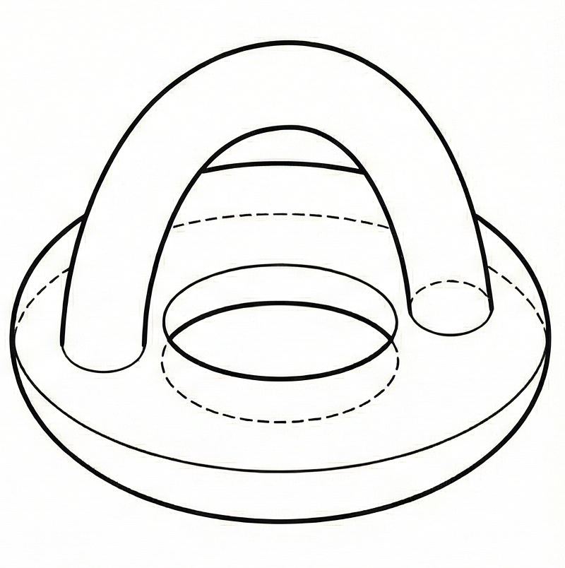
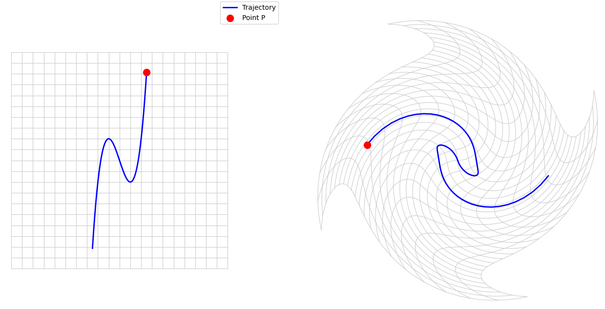
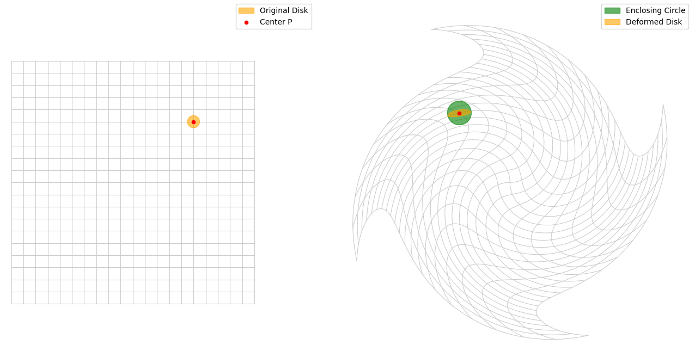

# 雑談

## 前提

自分は位相空間については既に直感的なイメージを持っているし、それについて色々考えたりもするけれど、数学を専攻していない人に説明する時には相手が理解していないことを前提にする以上は色々とぼかしたり誤魔化したりすることがある。別にちゃんとした定義を言えてほしいという訳じゃないけれど、概念的にだけでも知っていてくれると助かるなぁ、と思いました。ので、モチベーションと直感的な理解の部分だけ言語化してみることにした。

## $\epsilon$-$\delta$論法でええやん→距離空間へ

位相空間ってのは物事の連続性を論じるための土台で、これが無いと連続的な変化ってのを説明するために多大な労力がかかることになる。おそらく高校生とかの時に習う連続性というのは以下の様なものだと思う。

$$
f(x)が連続\iff\forall a,\lim_{x\to a}f(x)=f(a)
$$

つまり、$f(x)$の$x$を$a$に近づけた時の値が$f(a)$に近づくということだ。これは大学の言葉で書くとこうなる。念の為に言っておくが、書き方が違うだけで全く同じことを言っている。

$$
\forall a,\forall\epsilon>0,\exist\delta>0,\forall x,|x-a|<\delta\implies|f(x)-f(a)|<\epsilon
$$

これを$\epsilon$-$\delta$論法と呼び、一般的に関数の連続性と言えばこれを指すことになる。
ほな連続性を語る際はこれを使えばええか。とはならない。ここで述べているのは関数の連続性である。関数というのは数字を入れたら数字が出てくる様な仕組みの話だ。より一般に数学的な対象を入れて、数学的な対象が出てくる様な仕組みの場合は、流儀に拠ると思うが、写像(map)という言葉で表される。まぁでも、記号としては相変わらずfunctionの$f$がよく使われるのはご愛嬌と言ったところなのか。
数学で用いられる写像は数字以外の物を入れて数字以外の物が出てくることがよくある。例えば内積は$2$個のベクトルを入れると実数が出てくる写像だし、関数列なんかは自然数を入れると関数が出てくる写像だ。こういう時に「内積ってのは連続だから～」とか「関数が連続的に変化して～」みたいな主張を概念的なだけではなく数学的に正しい主張として論じるためには、数字以外のものに対しても距離の様なもの（$|x-a|<\delta$みたいな）を論じられるようにする必要がある。
そうしてベクトル空間にも距離が定義されたり、関数空間にも距離が定義されたり（関数$f$と$g$の距離の定義の一例としては、$\max|f(x)-g(x)|$などがある）した。距離さえ定義できれば連続性を述べることができる。やったね！でも、空間によっては距離の測り方によっては異なる空間であるということが分かったりもした。例えば先ほど関数空間の距離の入れ方として$\max|f(x)-g(x)|$を挙げたが、実は$\int|f(x)-g(x)|dx$という入れ方もある。そのどちらを距離として採用するかによって、写像が連続なのかどうかが変化するのである（詳しくは補足を確認）。すると次のようなやり取りが考えられる訳である。
「関数$f$は関数$g$に連続的に変化すると仮定したら、対応するパラメータも連続的に変化して～」
「それって関数空間の距離の入れ方に依存しないか？」
「ふーむ、例えばどんな距離だったらこの話は成立しなくなる？」
「え？いやそれは分からんけども…あってもおかしくないよね」
「そんなこと言われても、その様な距離が存在しないことを示すのは悪魔の証明になってまう～～～😭」
そこですべての距離について調べるというのは現実的ではないので、代わりに**距離であるなら最低限成り立つ性質**というのをまとめた。これが距離空間という概念の始まりな訳である。距離空間であることを使えば、上記のやり取りは以下のようになる。
「関数$f$は関数$g$に連続的に変化すると仮定したら、対応するパラメータも連続的に変化して～」
「それって関数空間の距離の入れ方に依存しないか？」
「いや、距離空間になるように距離を入れたら、距離空間のこの性質Aからこの結果が導けるんだよ。つまり入れる距離には依存しないよ」
~𝙃𝙖𝙥𝙥𝙮 𝙀𝙣𝙙~

もちろん、距離という概念に期待する性質は色々ある（例えば長さが距離と一致する様な最短経路がただ$1$つ存在しなくてはいけないとか）けれど、現代数学において「距離」というと以下の$3$つを満たすものとして定められている。

1. 常に非負の値であり、$0$になるのは同一の点の距離のみである。
2. 点$A$-$B$間の距離は点$B$-$A$間の距離に等しい。
3. 点$A$-$C$間の距離は点$A$-$B$間の距離$+$点$B$-$C$間の距離よりも小さい（三角不等式が成り立つ）。

ひとまずこれらを満たすものは全て距離と言えることとして、それ以外の性質については「もしそれが満たされるならイイ距離だね」みたいな感じで、距離を分類する性質の一種として扱われることになった。これは数学の一般論だが、基本的に概念を導入する際は可能な限り一般化された状態で扱い、それ以外の性質に対してはその中の分類として扱うというケースが多い。

さて、我々は$3$次元に生きる生命体であるので、ユークリッド空間についてはある程度詳しい。例えば、球面という概念を知っているし、その上で連続的に移動する点などを考えることができる。他にもトーラスという概念を知っていて、その表面上に連続的に移動する点というのを考えられる。それから、噂に聞きしクラインの壺とかいうのがあって、これもそういう点を考えられる。つまり、これらはすべて連続性を語ることができる対象なのである。

これらに対して距離空間の概念を用いて連続性を語ろうとすると、これらに距離を入れる必要があるのだ。限りなく面倒であるのが分かるだろうか。まぁいうて$3$種類しかないしやればできるべ。そんなあなたには以下の図を見てほしい。

これはハンドルを取り付けたトーラスである。ハンドルというのは実際の数学用語である。実際、ハンドルを付けるのはトーラスじゃなくクラインの壺でもいい。ハンドルを付けた図形に対してさらに追加でハンドルを付けることもできる。もっと言えば、これは手術の理論という名前の分野で行われる操作で、ハンドルを付け加えるというのは数多の手術の$1$つでしかないのだ。こういう全ての図形に対して距離を考えるのか？そりゃ無理ってもんよ。
こういう「直感的には連続なんだけど、距離とかそういうので納得している訳ではない」という図形ってのは無数にある。それは距離という概念が我々の直感する連続性を説明するには少々作為的なところがあるからだと思う。我々は「近づく」という概念を「$2$個の数の差」ではなく「$2$点間の距離」でもなく、もっと広い意味を持つ方法で認識しているのだ。ここでさらなる連続性の一般化の必要がでてきた。

## $\epsilon$-$\delta$論法の読解→そして位相空間へ

ひとまず連続性の一般化に向けて、$\epsilon$-$\delta$論法を深堀りしたい。再掲しよう。

$$
\forall a,\forall\epsilon>0,\exist\delta>0,\forall x,|x-a|<\delta\implies|f(x)-f(a)|<\epsilon
$$

これを日本語で書くなら、「すべての$a$に対して次が成り立つ。すなわち、任意の正の実数$\epsilon$に対して必ず$\delta$が存在して、$a$との差が$\delta$未満である様な範囲の$x$に対して$f(x)$と$f(a)$の差が$\epsilon$未満になる」となる。これが関数$f$が連続であるということを表す。ここで$|x-a|<\delta$だとか$|f(x)-f(a)|<\epsilon$という部分を「差」と表現したが、距離空間であるならばこれは「距離」と表現すべきものであり、より一般化するならここがキモになってくることは直感できるだろう。
さて、連続性を**壊さない**操作として空間をグニグニ動かすことが挙げられる。

この様な変形では連続な動きは連続な動きへと変形される。この現象をもう少し砕いて説明するなら、**点$P$に十分近い点は変形後も点$P$に十分に近い点へと移動する**ということだ。距離を前提とした表現に言い換えるなら、点$P$を中心とした円は、その半径が十分に小さければ、変形後も十分に小さい円に内包される、となる。

点$P$を内包する円板が変化したとしても、グニグニと動かした程度では所詮点$P$を内包する円板に近いものにしかならないというのがキーになっている。もしどれだけ小さい円板を持ってきてもそれを変換したものがあっちこっちに飛んでしまったりしたら、それを内包する円というのは小さくなることができないので、それは不連続であると言える。
ただ、円板という概念は「点$P$から距離が$r$以下の点の集合」と定義されるので、距離という概念を前提にしてしまっている。今回は距離をより一般化したいので、距離概念を使わずに済ませたい。「点$P$に十分近い点は変形後も点$P$に十分に近い点へと移動する」ということを説明する際は別に円板を使う必要はない。形自体は四角とかでも、点$P$を内包できるならなんでも良いのだ。ただし、直線とかはダメ。ここでいう内包するというのは「内側」に入っていることを指す。平面においては直線には内側とか無いからね。この様な、点$P$が「内側」にある様な図形を点$P$の**近傍**と呼ぶ。すると、連続性は次のように説明できる。すなわち、変形が点$P$で連続であるとは、**点$P$の十分小さい近傍を選べば、変形後も点$P$の十分小さい近傍に含まれる**、同じ意味になる言い換えだが、**変形後の$P$の近傍としてどんな小さい近傍を選んでも、変形前の点$P$の十分小さい近傍を取れば、その近傍の変形後は先に取った近傍に含まれる**ということである。先の図で言うなら、「変形後の近傍として緑色の円板が与えられても、変形前のオレンジ色の円板を十分小さく取れば、変形後のオレンジの円板が緑色の円板に含まれる」って感じ。数学的に書くなら以下である。ただし、変形を$f$としている。

$$
\forall U_{f(P)}:f(P)の近傍, \exist U_{P}:Pの近傍, f(U_{P})\subset U_{f(P)}
$$

繰り返しになるが、日本語に翻訳するなら、どんな$f(P)$の近傍$U_{f(P)}$に対しても$f(U_{P})$が$U_{f(P)}$に含まれる様な$P$の近傍$U_{P}$が存在する、という感じになる。これが現代的な連続の定義なのである。
ちなみに細かい証明は省くが、これと同値になる言い換えがあるので紹介する。それは「任意の$f(P)$の近傍$U_{f(P)}$に対して、$f^{-1}(U_{f(P)})$が$P$の近傍になる」という表現だ。さらに、もうひとつ用語を導入することでより簡便な表現にできる。集合$U$の任意の点にとって$U$が近傍となる場合、$U$は**開集合**と呼ばれる。近傍という用語は「点$P$の近傍」という具合に点に依存した表現になっていたが、開集合はその様な依存がなく、集合自体の性質として扱えるため、扱いが楽なのだ。この用語を使えば「任意の$f(P)$を含む開集合$U_{f(P)}$に対して、$f^{-1}(U_{f(P)})$が開集合になる」と表現できる。これ自体は「近傍」が「開集合」に変わっただけなのであまり恩恵を感じないが、点$P$のみにおける連続性ではなくて$f$という変換が全体で連続であることを表現しようとすると、「任意の開集合$U$に対して$f^{-1}(U)$が開集合である」と表現できる。多くの書籍などではこちらが連続性の定義として記述されているケースが多い。
以上が距離空間をさらに一般化した説明になる訳だが、少し曖昧にしてぼかした箇所がある。それは「内側」だ。円とか四角はOKなのに直線はダメって、ちょっと恣意的過ぎないだろうか？例えば関数空間だと何がOKで何がダメなの？と考えると答えが出せるだろうか？結論から言うと、関数空間に入れる距離によって何がOKで何がダメなのかは色んな定め方がある。つまり決まってないのだ。自分である程度好きに定義してよいのだ。そのOKな図形のみを近傍として扱うことで、正しく連続性を論じることができる。つまり逆に言うと、**どんな集合を近傍として扱って良いかを定めることで空間にどんな連続性を入れるのかを定めることができる**のだ。ちなみに結果的に同値になるが、多くの書籍ではここでも近傍ではなく開集合を用いている。これが位相空間のモチベーションとなる。開集合として扱っても良い集合を集めたものを開集合系（近傍を使って定める場合は近傍系）と呼ぶのだが、位相空間を定めるというのは開集合系を定めることに他ならないのだ。空間と開集合系を合わせて、位相空間、または単に位相と呼ぶ。開集合系に期待する性質は以下の$3$つである。なぜこれが位相に最低限必要とされる性質なのかという点についての説明はまたの機会にしたいと思う。

1. 空集合や全体集合を含むこと。
2. 開集合を任意個（無限個でも良い）集めて和集合を取っても開集合であること。
3. 開集合を有限個集めたその共通部分も開集合であること。

これが現代における連続性を最も一般的に論ずるための土台という訳だ。距離空間は距離化可能性という性質によって分類される良い位相空間の一種とされる。他にも色々と良い性質があるのだが、その種類や依存関係は非常に込み入っていて、それだけで一種の分野として成立するほどだ。他にも、位相空間が$2$個あるとしてそれらの直積に位相を入れたいだとか、点を同一視することで空間を貼り付ける様な操作に対して自然に位相を入れたいだとか、そういうモチベーションもある。これらはそれぞれ直積位相だとか商位相という言葉で説明されるが、今回は名前だけの紹介としたい。

## 余談

位相空間は近傍系でも開集合系でも定義できるって話をしたが、他にも閉集合系とか閉包作用/開核作用とかフィルタ/ネット（有向点族）を用いた定義などがある。実数の構成とかは結構話題にされがちなのに位相空間の定義はあんまり話題にならないのはさみしいと思う。興味があったら確認してみてほしい。[位相の特徴付け](https://ja.wikipedia.org/wiki/%E4%BD%8D%E7%9B%B8%E3%81%AE%E7%89%B9%E5%BE%B4%E4%BB%98%E3%81%91)

## 補足

具体的な話をしよう。$\max|f(x)-g(x)|$という距離の取り方は$L^{\infty}$ノルムと呼ばれている。これは分かりやすく、$2$個の関数の差の最大値を求めるものである。対して、$\int|f(x)-g(x)|dx$という距離の取り方は$L^1$ノルムと呼ばれていて、$2$個の関数に挟まれる領域の面積を求めるものになっている。
ここで$t$を正の値の範囲で考えるとして$f_{t}(x):=\max\Big\{1-\frac{|x-t|}{t},0\Big\}$と定める。つまり、$1-\frac{|x-t|}{t}$が正の値であればそちらを採用し、そうでなければ$0$という関数だ。$1-\frac{|x-t|}{t}$が正の値になるのは$0<x<2t$となる。関数の形としては、$x\leq0,2t\leq x$では$f(x)=0$で横一直線になっており、$0<x<2t$では$x=t$で高さ$1$のピークになる三角形の形になっている。この時、任意の$x$に対して$t\to+0$で$f_{t}(x)\to0$と収束する。つまり、$f_{0}\equiv0$と定義するのが自然になる。改めて書くと以下のように定める。

$$
f_{t}(x):=
\begin{dcases}
    \max\bigg\{1-\frac{|x-t|}{t},0\bigg\} & \text{if $t>0$} \\
    0 & \text{if $t=0$}
\end{dcases}
$$

さて、各$x$に対しては$t\to+0$においてこれで連続的に変化する訳であるが、関数としてはどうだろうか。つまり$L^{\infty}$ノルムおよび$L^1$ノルムにおいて$t$を$+0$に近づけたら、ちゃんと$f_{t}$は$f_{0}\equiv0$に近づくのかどうかを調べてみよう。$L^{\infty}$ノルムでは$f_{t}$と$f_{0}$の差の最大値なのだから、これは常に$1$となる。すなわち、$f_{t}$と$f_{0}$の距離は$t$に依らず常に$1$であり、近づくことはない。対して$L^1$ノルムでは$f_{t}$と$f_{0}$の距離はその間の領域の面積、つまり$0\leq x\leq2t$における三角形型の領域の面積なのだから、$t$となる。これは$t\to+0$において$0$に近づくため、$f_{t}$と$f_{0}$の距離も$0$に近づくと言える。したがって、$L^{\infty}$ノルムでは$\lim f_{t}\neq f_{0}$であるが、$L^1$ノルムでは$\lim f_{t}=f_{0}$ということになる。
ちなみにこれは所感だが、一般的に関数空間に距離を入れるなら$L^{\infty}$ノルムとか$L^1$ノルムよりは$L^2$ノルム（$\left(\int|f(x)-g(x)|^2dx\right)^{\frac{1}{2}}$）の方が自然だと思う。
