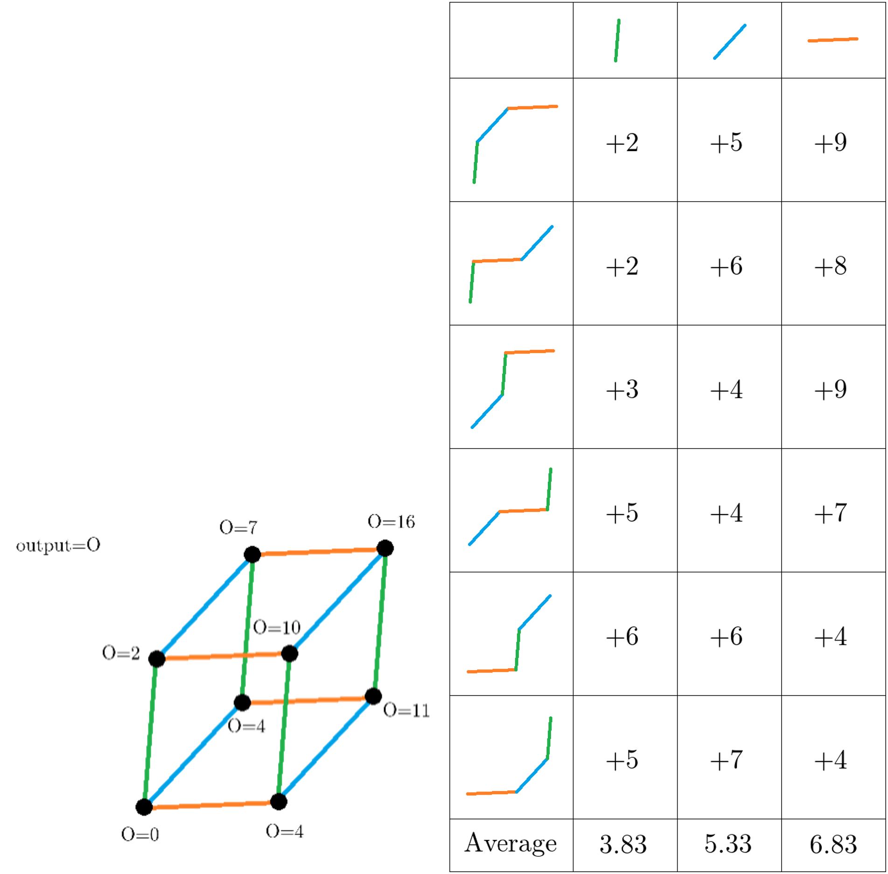

# 雑談

シャープレイ値とは、
> 協力によって得られた利得を各プレイヤーへ公正に[1] 分配する方法の一案である。

だそうです。Wikipediaにそう書いてた。
AさんとBさんが協力してスコア$100$を記録したとする。Aさんだけだと$30$、$B$さんだけだと$20$しか取れないとしたら、その$100$というスコアをAさんとBさんにどう分配するのが適正かな？という話を解決するための$1$つの手法がシャープレイ値という訳だ。
具体的な計算方法は次のような感じになる。具体例として$3$人のケースを考える。まず、それぞれが参加するか否かを$0,1$で表現することにする。例えば$(0,0,1)$だったら3番目の人だけが参加するみたいな。そして、最初$0$人から順番に参加していって$3$人チームになる順序について考えてみる。すると以下の$6$（$=3!$）通りになる。

$$
1.~(0,0,0)\to(0,0,1)\to(0,1,1)\to(1,1,1) \\
2.~(0,0,0)\to(0,0,1)\to(1,0,1)\to(1,1,1) \\
3.~(0,0,0)\to(0,1,0)\to(0,1,1)\to(1,1,1) \\
4.~(0,0,0)\to(0,1,0)\to(1,1,0)\to(1,1,1) \\
5.~(0,0,0)\to(1,0,0)\to(1,0,1)\to(1,1,1) \\
6.~(0,0,0)\to(1,0,0)\to(1,1,0)\to(1,1,1)
$$

この時、例えば$2$番目の人に着目すると、$2$番目の人が参加したのは順序$1$では$(0,0,1)\to(0,1,1)$のタイミングであり、順序$2$では$(1,0,1)\to(1,1,1)$のタイミングである。この変化によってスコアがどれだけ増えたのかを各順序ごとに調べて、平均を取ったものがシャープレイ値だ。図にすると以下のようになる。

この図におけるOutputがスコアとして、表のAverageがシャープレイ値に相当する。

さて、私は前から気になっていた。整数の集合$\{1,2,\ldots,n\}$の部分集合に対して、その分散をスコアとしてシャープレイ値を考えたらどうなるのかということを。そこでAIに聞いてみると、おおよそ二次関数の様な形になるはずだと言われたので、実際にPythonで計算して、二次関数をフィッティングさせてみると、以下のような結果になった。

おおよそとかじゃなくて完全に一致してる？！ということで、以下の定理が成り立つことを示しました。

**整数の集合$\{1,2,\ldots,n\}$の部分集合に対して、その分散をスコアとしてシャープレイ値を求めると、各値$i\in\{1,2,\ldots,n\}$に対するシャープレイ値は値に対して二次関数の関係にある。**

証明していこう。
まず、面倒なので名前を与えておく。$N:=\{1,2,\ldots,n\}$とする。$N$の部分集合を受け取って実数値を返す関数$f$に対して、$f$をスコアとした時の$i$のシャープレイ値は$\phi_i(f)$と書くことにする。分散を求める関数を$\text{var}$として、今回証明する主張は$\phi_i(\text{var})$が$i$の二次関数で記述できることと言うことが出来る。
次にシャープレイ値の基本性質を$1$つ紹介しておく。シャープレイ値は線形性を持つのである。すなわち、実数$\alpha,\beta$とスコアであるような関数$f,g$があるとして、$\alpha f+\beta g$のシャープレイ値は$f$と$g$のシャープレイ値をそれぞれ$\alpha$倍したものと$\beta$倍したものの和になる（$\phi_i(\alpha f+\beta g)=\alpha\phi_i(f)+\beta\phi_i(g)$が成り立つ）ということである。

では元の問題について考えてみよう。まず、分散を取る関数を$\text{var}$として、$2$乗の平均を取る関数を$F:=\frac{1}{n}\sum i^2$として、平均の$2$乗を取る関数を$\text{mean}^2:=(\frac{1}{n}\sum i)^2$として定める。この時、シャープレイ値の線形性から$\phi_i(\text{var})=\phi_i(F)-\phi_i(\text{mean}^2)$となる。
例えば、$\{1,2,3,4,5\}$で$3,1,5,4,2$という順で追加された場合を考えてみよう。$F$や$\text{mean}^2$はどの様に変化するだろうか。$F$の場合は$9(=3^2),5(=\frac{3^2+1^2}{2}),\frac{35}{3}(=\frac{3^2+1^2+5^2}{3}),\ldots$となり、$\text{mean}^2$の場合は$9(=3^2),4(=\left(\frac{3+1}{2}\right)^2),9(=\left(\frac{3+1+5}{3})^2\right),\ldots$となる。$5$が追加された時の増分をそれぞれ$\Delta_{5}(F),\Delta_{5}(\text{mean}^2)$とすると以下のように書ける。

$$
\begin{aligned}
\Delta_{5}(F) & =\frac{3^2+1^2+5^2}{3}-\frac{3^2+1^2}{2} \\
\Delta_{5}(\text{mean}^2) & =\left(\frac{3+1+5}{3}\right)^2-\left(\frac{3+1}{2}\right)^2
\end{aligned}
$$

である。一般化すると以下のようになる。

$$
\begin{aligned}
\Delta_{i}(F) & =\frac{i^2+\sum_{iの手前の数}j^2}{s+1}-\frac{\sum_{iの手前の数}j^2}{s} \\
\Delta_{i}(\text{mean}^2) & =\left(\frac{i+\sum_{iの手前の数}j}{s+1}\right)^2-\left(\frac{\sum_{iの手前の数}j}{s}\right)^2
\end{aligned}
$$

ただし、$i$の手前の数の個数を$s$とした。また、第$2$項は$s=0$の時$0$となるものとしている。$F$と$\text{mean}^2$のシャープレイ値は、全ての並び替えにおけるこれらの平均を求めれば良いので、それぞれ第$1$項と第$2$項の平均を求めてやれば良い。ただし、いずれも$i$の手前の数の個数$s$を分母に持っており、単純に平均を求めるのは少し難しい。そこで、各$s$ごとに分けて総和を取ることにする。すなわち、例えば$\Delta_{i}(F)$の平均の場合は以下のように計算することにする。

$$
\frac{1}{n!}\sum_{並び替え}\Delta_{i}(F)=\frac{1}{n!}\sum_{s=0}^{n-1}~\sum_{iの手前がs個になる並び替え}\Delta_{i}(F)
$$

総和記号の下の文章が長くなってきたので、以降は$\sharp i$を$i$の手前の数の個数を表すと考えて、$\sum_{iの手前の数}$は$\sum_{\sharp j<\sharp i}$と記述することにし、$\sum_{iの手前がs個になる並び替え}$は$\sum_{\sharp i=s}$と略記することにする。

まずは$\Delta_{i}(F)$の第$2$項を考える。平均は以下のように計算される。

$$
\frac{1}{n!}\sum_{s=0}^{n-1}\sum_{\sharp i=s}\frac{\sum_{\sharp j<\sharp i}j^2}{s}=\frac{1}{n!}\sum_{s=1}^{n-1}\left(\frac{1}{s}\sum_{\sharp i=s}\sum_{\sharp j<\sharp i}j^2\right)
$$

右辺の最後の総和を計算してみよう。各$j\neq i$に対して、$j^2$が何回足されるかを考えると、それは$i$の手前の$s$個に$j$が含まれる並び替えの場合の数なので$s(n-2)!$となる。したがって以下のように式変形できる。

$$
\begin{aligned}
\sum_{\sharp i=s}\sum_{\sharp j<\sharp i}j^2 & =s(n-2)!\sum_{j\neq i}j^2 \\
& =s(n-2)!\left(\frac{1}{6}n(n+1)(2n+1)-i^2\right)
\end{aligned}
$$

以上より以下が成り立つ。

$$
\frac{1}{n!}\sum_{s=0}^{n-1}\sum_{\sharp i=s}\frac{\sum_{\sharp j<\sharp i}j^2}{s}=\frac{1}{n}\left(\frac{1}{6}n(n+1)(2n+1)-i^2\right)
$$

右辺は大きく見ると$i$の二次関数である。
同様に$\Delta_{i}(F)$の第$1$項を考えると以下のようになる。

$$
\begin{aligned}
\frac{1}{n!}\sum_{s=0}^{n-1}\sum_{\sharp i=s}\frac{i^2+\sum_{\sharp j<\sharp i}j^2}{s+1} & =\frac{1}{n!}\sum_{s=0}^{n-1}\left(\frac{1}{s+1}\left((n-1)!i^2+\sum_{\sharp i=s}\sum_{\sharp j<\sharp i}j^2\right)\right) \\
& =\frac{1}{n(n-1)}\sum_{s=0}^{n-1}\left(\frac{1}{s+1}\left((n-1)i^2+s\left(\frac{1}{6}n(n+1)(2n+1)-i^2\right)\right)\right) \\
& =\frac{1}{n(n-1)}\left(\sum_{s=0}^{n-1}\frac{n-s-1}{s+1}\right)i^2+\frac{(n+1)(2n+1)}{6(n-1)}\sum_{s=0}^{n-1}\frac{s}{s+1} \\
\end{aligned}
$$

これも大きく見ると$i$の二次関数になっている。
次に$\Delta_{i}(\text{mean}^2)$の第$2$項を考えると以下のようになる。

$$
\begin{aligned}
\frac{1}{n!}\sum_{s=0}^{n-1}\sum_{\sharp i=s}\left(\frac{\sum_{\sharp j<\sharp i}j}{s}\right)^2= & \frac{1}{n!}\sum_{s=1}^{n-1}\frac{1}{s^2}\sum_{\sharp i=s}\left(\sum_{\sharp j<\sharp i}j\right)^2 \\
= & \frac{1}{n!}\sum_{s=1}^{n-1}\frac{1}{s^2}\sum_{\sharp i=s}\left(\sum_{\sharp j<\sharp i}j^2+\sum_{\substack{\sharp j,\sharp k<\sharp i \\ j\neq k}}jk\right) \\
 & ((j,k)=(0,1)と(j,k)=(1,0)を別としてカウントするため、係数に2が付かないことに注意) \\
= & \frac{1}{n(n-1)}\left(\frac{1}{6}n(n+1)(2n+1)-i^2\right)\sum_{s=1}^{n-1}\frac{1}{s}+\frac{1}{n!}\sum_{s=1}^{n-1}\frac{1}{s^2}\sum_{\sharp i=s}\sum_{\substack{\sharp j,\sharp k<\sharp i \\ j\neq k}}jk
\end{aligned}
$$

最後の総和を計算してみよう。$i$と異なり、互いにも異なるような各$j,k$に対して、$jk$が何回足されるかを考えると、それは$i$の手前の$s$個に$j,k$が含まれる並び替えの場合の数なので$s(s-1)(n-3)!$となる。したがって以下のように式変形できる。

$$
\begin{aligned}
\sum_{\sharp i=s}\sum_{\substack{\sharp j,\sharp k<\sharp i \\ j\neq k}}jk & =s(s-1)(n-3)!\sum_{\substack{j,k\neq i \\ j\neq k}}jk \\
& =s(s-1)(n-3)!\left(\left(\sum_{j\neq i}j\right)^2-\sum_{j\neq i}j^2\right) \\
& =s(s-1)(n-3)!\left(\left(\frac{1}{2}n(n+1)-i\right)^2-\left(\frac{1}{6}n(n+1)(2n+1)-i^2\right)\right) \\
& =s(s-1)(n-3)!\left(2i^2-n(n+1)i+\frac{n(n+1)(n-1)(3n+2)}{12}\right)
\end{aligned}
$$

以上より以下が成り立つ。

$$
\begin{aligned}
\frac{1}{n!}\sum_{s=0}^{n-1}\sum_{\sharp i=s}\left(\frac{\sum_{\sharp j<\sharp i}j}{s}\right)^2= & \frac{1}{n(n-1)}\left(\frac{1}{6}n(n+1)(2n+1)-i^2\right)\sum_{s=1}^{n-1}\frac{1}{s}+\frac{1}{n!}\sum_{s=1}^{n-1}\frac{1}{s^2}\sum_{\sharp i=s}\sum_
{\substack{\sharp j,\sharp k<\sharp i \\ j\neq k}}jk \\
= & \frac{1}{n(n-1)}\left(\frac{1}{6}n(n+1)(2n+1)-i^2\right)\sum_{s=1}^{n-1}\frac{1}{s} \\
& +\frac{1}{n(n-1)(n-2)}\left(2i^2-n(n+1)i+\frac{n(n+1)(n-1)(3n+2)}{12}\right)\sum_{s=1}^{n-1}\frac{s-1}{s} \\
\end{aligned}
$$

これも大きく見れば$i$の二次関数である。
最後に$\Delta_{i}(\text{mean}^2)$の第$1$項を考えると以下のようになる。

$$
\begin{aligned}
\frac{1}{n!}\sum_{s=0}^{n-1}\sum_{\sharp i=s}\left(\frac{i+\sum_{\sharp j<\sharp i}j}{s+1}\right)^2 & =\frac{1}{n!}\sum_{s=0}^{n-1}\frac{1}{(s+1)^2}\sum_{\sharp i=s}\left(i^2+2i\sum_{\sharp j<\sharp i}j+\sum_{\sharp j<\sharp i}j^2+\sum_{\substack{\sharp j,\sharp k<\sharp i \\ j\neq k}}jk\right) \\
& = \frac{1}{n}i^2\sum_{s=0}^{n-1}\frac{1}{(s+1)^2} \\
& \quad + \frac{1}{n(n-1)}\left(n(n+1)i-2i^2\right)\sum_{s=0}^{n-1}\frac{s}{(s+1)^2} \\
& \quad + \frac{1}{n(n-1)}\left(\frac{1}{6}n(n+1)(2n+1)-i^2\right)\sum_{s=0}^{n-1}\frac{s}{(s+1)^2} \\
& \quad + \frac{1}{n(n-1)(n-2)}\left(2i^2-n(n+1)i+\frac{n(n+1)(n-1)(3n+2)}{12}\right)\sum_{s=0}^{n-1}\frac{s(s-1)}{(s+1)^2}
\end{aligned}
$$

もう辛いので最後の計算はAI出力だし自分も検算はしていないが、これも$i$の二次関数である。
よって$\phi_i(F)$も$\phi_i(\text{mean}^2)$も$i$の二次関数であり、$\phi_i(\text{var})=\phi_i(F)-\phi_i(\text{mean}^2)$も当然$i$の二次関数であるということである。あーつかれた。

あれこれ式変形していて気づいたのは、総和の部分は$i$の手前の数の個数$s$に関する総和に押し付けられるので、結局$i$の式として見ると二次関数になるという形ばかりだということ。結局分散が$2$乗の平均から平均の$2$乗を引いた数であるというのが今回は効いていた。平均を得る操作は要素数$s$に依存するが、$1/s$倍という変数分離可能な形なのでそこまで問題なかった。$2$乗の平均はともかく、平均の$2$乗も$2$次関数に抑えられたのは偶然なのだろうか？個人的には偶然ではなく、たかだか$n$次の対称的な多変数関数であればそのシャープレイ値もたかだか$n$次なのではないかと予想している。ある意味、「たかだか$n$次」という性質が「シャープレイ値を対応させる関数を得る」という操作を貫通している、と表現できる気がするが、かたや部分集合を入力としてかたやその要素を入力としているのだから、簡単に比較して「同じ性質だ」と考えられるものではないだろう。
対称的であれば貫通する、と言ったがもちろん単に対称的であれば良いというものでもなくて、要素数がどう関わるかというのも大事であろうと思う。「要素が$s$個ならば$s$乗の総和」みたいな感じの関数を考えるとおそらくこのシャープレイ値はひどいことになるだろう。$2$変数関数$(x,y)\mapsto x^2+y^2$と$3$変数関数$(x,y,z)\mapsto x^3+y^3+z^3$はどちらもたかだか$s$（全体集合の要素の個数）次の多項式だが、そういう括り方はできないのだ。おそらく、基本対称式を単位として、それらの要素数$s$の関数を係数とした和差積として書ける必要があるのかなぁと思う。もしくは$x_1+x_2+\cdots+x_n$とか$x_1^2+x_2^2+\cdots+x_n^2$とかのべき乗の総和を単位とするのが良いかもしれない。
多少基本対称式について詳しければ、「基本対称式を単位とする」ことと「べき乗の総和を単位にすること」の差はあまり意味があるものではないと感じるかもしれないが実は違う。それについての話も含むが、対称な多変数関数の自然な高次元化についての話をしてみよう。例えば$(x,y,z)\mapsto xy+yz+zx$の$4$変数バージョンは$(x,y,z,w)\mapsto xy+xz+zw+yz+yw+zw$と$(x,y,z,w)\mapsto xyz+yzw+zwx+wxy$のどちらだと考えるのが自然なのかという問題を考える。前者は基本対称式として次数を維持しているが、後者は特定の$1$個以外を選ぶというアルゴリズムとして一貫している。この場合、前者はシャープレイ値を貫通するが、後者はしない。前者の方が自然な高次元化だから当然だと考える人もいるだろうが、それでは$(x,y,z)\mapsto\frac{1}{x}+\frac{1}{y}+\frac{1}{z}$の$4$変数バージョン拡張を考えるならどうだろうか？$\frac{1}{x}+\frac{1}{y}+\frac{1}{z}=\frac{xy+yz+zx}{xyz}$なので前者の方法で自然に拡張するなら$\frac{xy+xz+zw+yz+yw+zw}{xyz+yzw+zwx+wxy}$というキモい式になるが、後者ならば$\frac{xyz+yzw+zwx+wxy}{xyzw}=\frac{1}{x}+\frac{1}{y}+\frac{1}{z}+\frac{1}{w}$となって良い感じだ。これでも前者の方が自然な高次元化だと思うだろうか？次の例は、$(x,y)\mapsto x^3+y^3$の$3$変数バージョンを考えてみたい。$x^3+y^3=(x+y)^3-3xy(x+y)$なので、基本対称式として次数を維持して高次元化すると$(x+y+z)^3-3(xy+yz+zx)(x+y+z)=x^3+y^3+z^3-3xyz$となる。だが、流石に自然な高次元化は$x^3+y^3+z^3$になるべきなのではないだろうか？基本対称式として考えるかべき乗の総和として考えるかによって、自然な高次元化が異なるのだ。ちなみにこれはどっちの方針で高次元化してもシャープレイ値は貫通する。それはそれとして、単に基本対称式の次数を維持して変数を増やすというのが自然な高次元化と言えるのかという点について一石を投じられる様な例ではあると思う。最後の例として、$(x,y,z)\mapsto\frac{1}{x}+\frac{1}{y}+\frac{1}{z}$をべき乗の総和を単位として分母分子を$4$変数バージョン拡張をしてみよう。まず、直感的には$x^{-1}+y^{-1}+z^{-1}$と解釈して拡張すると普通に$\frac{1}{x}+\frac{1}{y}+\frac{1}{z}+\frac{1}{w}$になると考えられる。だが、$\frac{1}{x}+\frac{1}{y}+\frac{1}{z}=\frac{xy+yz+zx}{xyz}$として分母分子をそれぞれ拡張するとどうなるだろうか？実は分母の拡張がかなりとんでもないことになる。単に「べき乗の総和を単位とする」としてもこういう方針の差異も存在する。こうなると、「自然な高次元化とは何なのか」という問いが如何に深遠なのかを感じざるを得ない。
