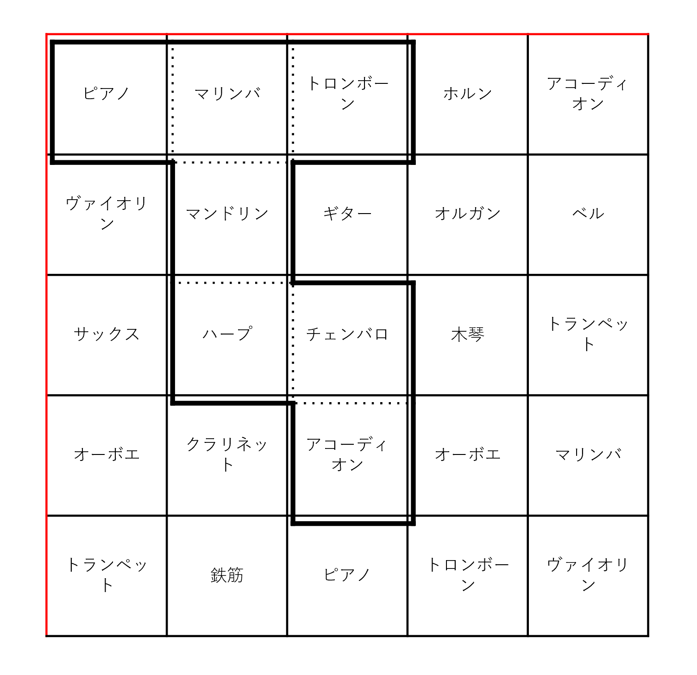

# 雑談

## イントロ

最近アートゥーンというチャンネルの動画がオススメに流れてきたので見てみた。趣旨としては音楽で芸術大学を卒業した人が卒業した時に作った曲（卒作）についての解説だった。その人は数字が好きで、数字になぞらえて曲を作るというのにハマっていたらしい。そして卒作は「7」をテーマに音楽を作ろうという試みを行ったそうで、目をつけたのがヘプトミノだった。
ヘプトミノとは何か、を説明するにはまずポリオミノについて説明する必要がある。ポリオミノとは複数の同じ大きさの正方形をそれぞれの辺同士で接する様にくっつけて作れる2次元図形を指す。有名なもので言えばテトリスで降ってくるミノはいずれもポリオミノの一種である。そして、使っている正方形の個数で更に分類されていて、正方形の個数が7個の場合がヘプトミノという訳である。ちなみに4つの場合がテトリミノであり、テトリスの語源である。
ヘプトミノは108個存在し、その卒作では「全てのヘプトミノを演奏する」ということをモチベーションとしていた。具体的には個々のヘプトミノに対して「楽器」「音程」「リズム」を対応させ、それを108個繋げて音楽にしたということである。そして今回この記事で取り上げたいのは「楽器」の割り当て方である。方法としては以下のように楽器が書かれた表を用意して、そこに演奏したいヘプトミノを左上に詰める様に重ねて、重なった箇所にある楽器を使おうということである。

この場合は以下の様になるため、ピアノ、マリンバ、トロンボーン、マンドリン、ハープ、チェンバロ、アコーディオンという訳である。ちなみにこの表は実際に使われたものではなく、私が説明用に適当に作った表であるためあしからず。

ここでその動画の人は、108個のヘプトミノを全て内包しうる最小の表はどの様なものかを調べて、ヘプトミノを重ねた時に良い感じになる楽器の配置を考えたりなどに注力したらしい。数学科として私が気になったのはこの「108個のヘプトミノを全て内包しうる最小の表」の存在である。これはなんという心躍るテーマだろうか。しかしここではもう少し一般化して考えてみたい。
ヘプトミノというものに限らず、何かを集めてそれを包含する最小のモノを考えるという操作そのものが非常に面白いと言えるだろう。今日はこの切り口でいくつかの難問を紹介したい。

## 何らかの集合を含む最小の◯◯

ではさっそく具体例を挙げていこう。

### 掛谷問題

まず、単位線分の集合を考える。ただし、線分の位置が違っていても同じ線分と考えるが、線分の向きが異なる場合は別の線分と考える。この時、これらの線分を全て含む様な最小面積の図形はなんだろうか？つまり、全ての方向の線分を包含する様な最小図形は？この問題が掛谷問題である。
例えば直径1の円はその様な例になっている。もう少し小さな例としてルーローの三角形が挙げられる。さらに小さな例として高さが1の正三角形が挙げられる。正三角形の各辺に余裕があるので、もう少し内側にたわませて面積を減らすことができる。これがどこまで行けるか？という話である。結論から言うとこの問題は解決していて、**どこまでも小さく出来る**ということが証明されている。

### モーザーのワーム問題

掛谷問題は直線であった。ではそうではなく、長さが1のあらゆる曲線にしたらどうなるだろうか？これがモーザーのワーム問題である。**未解決問題**である。直径1の円は長さ1のあらゆる曲線を内包する十分なスペースを有している。実は、高さ$\frac{1}{2}$の正三角形を$2$つくっつけて得られるひし形も条件を満たす。このひし形の片方の鈍角の頂点はもう少し削れる。今のところそれが見つかっている最小の図形である。ちなみに解が存在することはブラシュケの選択定理から示されている。

### ルベーグの普遍被覆問題

モーザーのワーム問題は曲線であった。ではそうではなく、直径が1のあらゆる平面図形にしたらどうなるだろうか？ここでいう直径とは、図形内の2点が取りうる全ての距離の上限である。これら全てを包含する凸図形を考えるというのが、ルベーグの普遍被覆問題である。これも**未解決問題**である。そしてこちらも解の存在はブラシュケの選択定理から示されている。

### 超置換

スーパーミューテーションとも。$n$個の記号の全ての置換を部分文字列として含む文字列を指す。例えば、$3$つの文字であるところの$1$と$2$と$3$があるとして、これらの置換というのは$123,132,213,231,312,321$の$6$通りになる。これらを部分文字列として含む最小の超置換は$123121321$である。最小の超置換の長さがどうなるかについては**未解決**で、一般の$n$に対しては下界である$n!+(n-1)!+(n-2)!+n-3$と上界である$n!+(n-1)!+(n-2)!+(n-3)!+n-3$がそれぞれ与えられている。ちなみに、下界を与えたのは4chanの匿名投稿者であり、上界を与えたのはハードSF作家であるグレッグ・イーガンである。この問題は涼宮ハルヒの憂鬱のアニメ全14話が物語の時系列とは異なる順序で放送されていたため、どういう順序で見れば全パターンを包含しうるのかという形で話題になっており、ハルヒ問題とも言われている。SFとの親和性が高いのかな？

### ド・ブラウン数列

超置換は繰り返しを許さない順列であった。繰り返しを許したらどうなるだろうか？例えば、$2$つの文字であるところの$1$と$2$を使った長さ$3$の文字列は$111,112,121,122,211,212,221,222$の$8$通りになる。これらを部分文字列として含む最小の文字列は$1112221211$である。これをド・ブラウン数列と呼ぶ。一般に長さ$m$の文字列から長さ$n$の部分文字列を抜き出す方法は$m-n+1$通りになるため、$k$種の文字で長さ$n$の文字列を考えるなら包含しなくてはいけない文字列は$n^r$通りになり、そこからド・ブラウン数列の長さの**下限として$k^n+n-1$が与えられるが、実際にその長さのド・ブラウン数列が得られることが分かっている**。ちなみにその様なド・ブラウン数列は$(k!)^{k^{n-1}}$通りあるらしい。オイラー閉路の探索やBEST定理といったグラフ理論を用いて証明できるみたいだぞ。

### 頂点数$n$の有限グラフを含む最小グラフ

グラフ理論におけるグラフというのは頂点とそれらを結んだ辺の情報を持った数学的対象を指す。特に頂点と辺の個数が有限のものを有限グラフ、可算無限のものを可算無限グラフと呼ぶ。また、特定のグラフに対してその頂点の部分集合を取り、その選んだ頂点間に張られている辺も全て集めてきて得られる、元のグラフよりもちょっと小さいグラフのことを誘導部分グラフと言う。この時、頂点の個数が$n$であるような全てのグラフを誘導部分グラフとして包含する様な中で頂点数が最小のグラフという物を考えることが出来る。その様なグラフの頂点数$f(n)$は分かる範囲では**未解決**であり、$2^{(n-1)/2}\leq f(n)\leq n2^{n/2}$を満たすことが分かっているようだ。

### 普遍グラフ

じゃあ可算無限グラフまで含めてあらゆるグラフを含むグラフを考えたらどうなるだろうか。それは普遍グラフと呼ばれる。特にラドグラフという普遍グラフはラドグラフ自身も可算無限グラフになる。つまり、任意の普遍グラフはラドグラフを誘導部分グラフとして持つわけである。その意味でラドグラフは最小？と言える気がする。が、ここで問題なになるのは実はこの包含関係は順序関係になっていないということだ。具体的に言うと、グラフ$G$とグラフ$G'$は同型ではないとしても$G$が$G'$を包含し、$G'$が$G$を包含するといったことがあり得る。つまりこの問題には**最小解が存在しない**！

## まとめ

今回は数学の問題を紹介するという感じであんまり込み入った話は避けてみた。というのも主題が「新しい切り口で数学の問題を考えてみる」ということだったからだ。何故そういうことをするのかというと、AIが数学の問題を解いてくれる様になった昨今において、数学研究の比重は徐々に「問題を解くこと」から「適切な問題を設定すること」に傾いてきていると私は思う。そのアプローチとして、切り口を持つというのは大事なのだ。答えが分からなくても様々な未解決問題を見ることはそういう力を養う良い練習になるだろうと思う。
