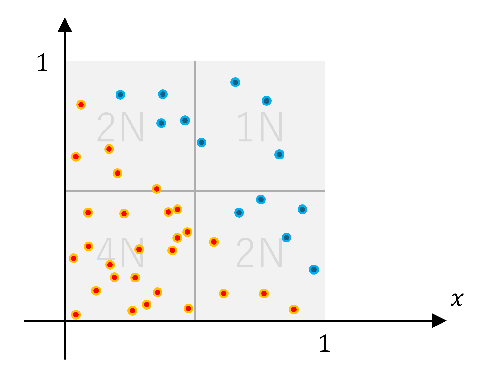
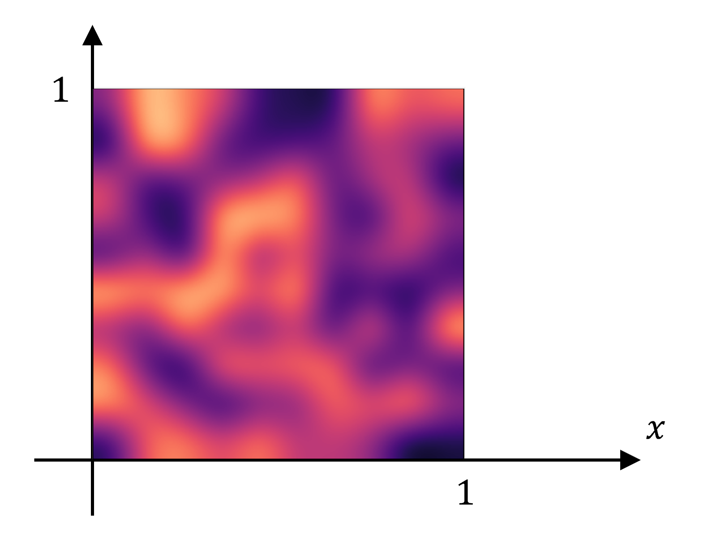

# 雑談

みなさんは確率をご存知だろうか。まぁほとんどの人は知っているだろう。では確率空間は知っているだろうか。そして$\sigma$-加法族はどうだろうか？
今回はその辺りの話をする。具体的に言うと、有限加法族の方が$\sigma$-加法族よりも直感的な確率を構築できるケースがあるという話をしたい。一応$\sigma$-加法族を使った確率の定義という基礎的な部分から説明するつもりなので、頑張って付いてきて欲しい。

## 確率と面積

確率を求めるというのはおおよそ求積（面積などを求めること）と等しい。と言うと厳密な考え方をする人から怒られそうではあるが。例えば、閉区間$[0,1]$からランダムな数字$x,y$を取ってきて、その和が$1$以下になる確率はどうなるだろうか。$xy$平面の$0\leq x\leq1,0\leq y\leq1$の正方形の範囲を考える。$x$と$y$を$[0,1]$区間からランダムに取ってきた結果はこの正方形の各点に対応していると考えられる。例えば$x$が$0.1$で$y$が$0.2$であったという結果は$(x,y)=(0.1,0.2)$という点に対応している。するとこの正方形は標本空間と$1$対$1$に対応しており、求めるべき確率は「正方形の中の点の個数」を全体とした時の「正方形の中の$x$座標と$y$座標の和が$1$以下の点の個数」の割合である。

といっても、これは実数で考えているので点の個数というと両方無限になってしまう訳だが。ただし、この場合は$x$も$y$も閉区間$[0,1]$から一様にランダムに取ってくる訳だから、点の個数は点が存在するエリアの面積と比例すると考えられる。従って「正方形の中の$x$座標と$y$座標の和が$1$以下のエリアの面積」を「正方形の面積」で割れば求めたい値が出てくる。

この様に確率は面積のようなものだと解釈して論じられることが多い。ここで言う「面積のようなもの」とは「面積」だけじゃなく「長さ」や「体積」の様な幾何的に測られる量を指す。これらは測度と呼ばれる。さっきは変数が$2$つだったから面積だったが、$1$つだったら長さで$3$つだったら体積になる。しかし、普通の意味での面積や体積の割合というのがそのまま確率になるのは一様なランダムの時だけである。この世界に存在するほとんどの確率というのは偏りが存在し、一様なランダムになることはあまりない。例えばさっきの例と同じく閉区間$[0,1]$からランダムな数字$x,y$を取るとして、ただしそのランダムが一様ではなく$0.5$未満の数字は$0.5$以上の数字よりも$2$倍出やすいとしたらどうだろうか？その場合はさっきの議論で言うところの「点の個数は点が存在するエリアの面積と比例する」という箇所が成り立たない。件の正方形を縦横に$4$分割した時の右上にある点の個数を$1N$とするなら右下と左上は$2N$で、左下は$4N$になる。

各領域では「点の個数は点が存在するエリアの面積と比例する」が成り立つが、その比例の係数が領域ごとに差があるのだ。この様に領域によって単位面積あたりの点の個数（濃度）が異なる様子を指して数学では「分布」と呼ぶ訳である。そしてこの分布を面積の重みとして解釈する。イメージとしては左下の領域で面積を測ると右上の領域で測った時と比較して$4$倍の値が出てくるという感じだ。そう考えると、ちょっと変な空間ではあるがこの空間でも確率は求積の一種であると考えられる。
さっきは上下左右の$4$分割であったが、もっと細かく無限に細分化してそれぞれの細分化された領域で異なる濃度で点が分布している場合、その濃度は実数的に分布する。ヒートマップをイメージしてもらえると良いだろう。

明るい領域はたくさん点が分布しており、暗い領域はあまり点が分布していない。この場合における面積の求め方は、おおよその場合、領域を細分して近似的に求めた面積に対して細分を細かくしていく様な極限で以て真値を求めるという形になる。それはまさにリーマン積分の概念であり、確率が積分を用いて定義される理由であると言えるだろう。

## 確率と総和

さて、よくある誤解として次のような話が出来る。つまり例えば閉区間$[0,1]$から一様にランダムな数字$x$を取ってくるとする。それがぴったり$0.5$である確率を考えてみよう。それが$0$ではない実数$\epsilon$であるとする。するとこのランダムは一様なのだから$0.1$や$0.02$や$0.141592$といった実数を取ってくる確率も同じく$\epsilon$であると言えるだろう。ここで「同時には起きない様な複数の事象に対して、それらのいずれかが起きる確率というのは、それぞれが起きる確率の総和になる」ので、適当な相異なる$[0,1]$区間の実数を$N$個取ってきたら、それらのいずれかを取る確率は$\epsilon+\epsilon+\cdots+\epsilon=N\epsilon$になる。$\epsilon$は$0$ではないので$N$が十分大きいとその値は$1$を超えてしまうが、確率は$1$を超えないはずなので矛盾である。したがってぴったり$0.5$という数字を取ってくる確率は$0$である。同様に$[0,1]$区間のどの数字も取ってくる確率は$0$である。また、「同時には起きない様な複数の事象に対して、それらのいずれかが起きる確率というのは、それぞれが起きる確率の総和になる」ので、$[0,1]$区間の全体の確率はぴったり$0.5$になる確率やぴったり$0.1$になる確率などの総和である$0$になってしまい、矛盾する。この議論は一見間違ってない様に見える。が、実は「同時には起きない様な複数の事象に対して、それらのいずれかが起きる確率というのは、それぞれが起きる確率の総和になる」という箇所がキーになっている。これは通常は正しいのだが、この「複数」というのは厳密には高々可算無限を指しており、非可算無限になると成り立たないのだ。$[0,1]$区間には数字が非可算無限個存在するので、ぴったり$0.5$になる確率やぴったり$0.1$になる確率などを足し合わせても$[0,1]$区間の全体の確率になるとは言えないのである。ちなみにぴったり$0.5$になる確率やぴったり$0.1$になる確率はいずれも$0$であるというのは正しい。
もう$1$つの例を挙げてみよう。ランダムな自然数を取ってくることを考えてみよう。まずは$1$という数字が選ばれる確率を$0$ではない実数$\epsilon$とする。これも先の例と同様に$N$個の実数を選んでそのいずれかが選ばれる確率は$N\epsilon$になる。この値は十分大きな$N$に対して$1$を超えるので、$1$が選ばれる確率は$0$であると言える。そして「同時には起きない様な**高々可算無限の**複数の事象に対して、それらのいずれかが起きる確率というのは、それぞれが起きる確率の総和になる」ので、自然数全体の確率は、$1$を選ぶ確率$+2$を選ぶ確率$+3$を選ぶ確率$+\cdots$という総和で求められ、その値は$0$である…。これは何を間違えたんだろうか？実は間違えていないのである。数学における通常の意味での確率では「ランダムに一様な自然数を取ってくる」という事象を扱うことはできないのである。だから例えば「ランダムな自然数を取った際にそれが偶数である確率は？」と聞かれたらあなたは「$1/2$」ではなく「定義不可能」と答えなくてはならない…。

## $\sigma$-加法族と測度

これらの非直感的な挙動は歴史的な数学において標準的な確率というのが$\sigma$-加法族をベースに公理付けられているのが問題である。$\sigma$-加法族とは測度の振る舞いについて定義づけているルールである。その中に以下のようなルールがある。

$$
集合の列\{E_i\}_{i\in\mathbb{N}}がいずれも測度を持つならば、その合併である\bigcup_{i\in\mathbb{N}}E_iも測度を持つ
$$

ここでいう「測度を持つ」というのは測度が定義されているという意味である。測度が定義されていないケースがあるのか？というとある。有名な例で言えば、$x$座標も$y$座標も有理数であるような有理点を集めた集合の面積なんかはリーマン積分の定義で見ると定義不可能になる。これに基づいて通常の測度は以下のルールを持つ。

$$
集合の列\{E_i\}_{i\in\mathbb{N}}がどの二つも互いに共通部分を持たないならば、\mu\left(\bigcup_{i\in\mathbb{N}}E_i\right)=\sum_{i\in\mathbb{N}}\mu(E_i)
$$

これこそが「同時には起きない様な高々可算無限の複数の事象に対して、それらのいずれかが起きる確率というのは、それぞれが起きる確率の総和になる」を式にしたものとなっている。添字の部分が$\mathbb{N}$になっているのが高々可算無限であることを示している訳である。
ではなぜその様な定義になっているのか？その理由は例えば「コインを無限回投げる」だとかの無限列の極限においてその方が都合が良いからだとか。積分を測度にするためにはこの性質を要求するからだとかそういう話になるらしい。

## 有限加法族と容積

これらの定義に対して「積分の時に都合が良いからそう定義した、ってあまりにも数学的な都合の良さを優先しすぎだ」と思った人がいるらしい。そういう人たちは$\sigma$-加法族の代わりに有限加法族をベースにして確率を定義づけることを提案している。その方が素朴に直感的な結果が得られるという話だ。有限加法族は基本的には$\sigma$-加法族と同じ定義なのだが、先に紹介したルールだけ無くて、代わりに以下が追加されている。

$$
集合E_1,E_2がいずれも測度を持つならば、その合併であるE_1\cup E_2も測度を持つ
$$

これをベースに定められた測度のことを容積（または有限加法的測度）と呼び、そちらも測度とほとんど同じルールを持つが、先に紹介したルールの代わりに以下のルールが追加されている。

$$
E_1とE_2が共通部分を持たないならば、\mu(E_1\cup E_2)=\mu(E_1)+\mu(E_2)
$$

この定義であれば適切に定めることで「ランダムな自然数を選ぶ」こともできるし、「それが偶数になる確率が$1/2$である」ということも可能である。
そもそも有限と無限の差というのは大きいものであるが、可算無限と非可算無限の差って実はそんなに大きいものじゃないと思っていて、$\sigma$-加法族のようにそこに（可算無限の合併の測度は各測度の総和と一致して、非可算無限の合併の測度は各測度の総和と一致しないという具合に）境界線を引くのは恣意的過ぎるとはちょっと思う。その点有限加法族は有限な合併か無限な合併かという区別であり、何となく自然な定義に見える。

## 任意無限加法族？

そしたら任意の無限に対してその合併の測度が各測度の総和と一致するとしたらどうなるだろうか。任意の無限の集合を考えて、そこから一様にランダムに値を取ることにする。各点の測度は$0$なのだからその総和で全体の測度も$0$になる。すなわち、任意の無限の濃度に対して一様分布が考えられなくなるのである。これはたまったものではない。そう考えると$\sigma$-加法族というのは上手い具合に実数濃度におけるそういう破綻を避けつつ無限を内包する積分を定義づけられる様になっている訳である。

## まとめ

もうとっくに知っていると思っていた概念であってもよくよく調べてみると歴史的背景から何故かそうなっているだけのものというのも多々ある。そもそも現代の確率論の基盤は1933年にコルモゴロフによって導入されたものを前提としており、比較的近代に近い時代の話なのである。これからそれらが変わらないということもないだろうし、むしろ変えていくパワーを必要としているのではないかと思う。
